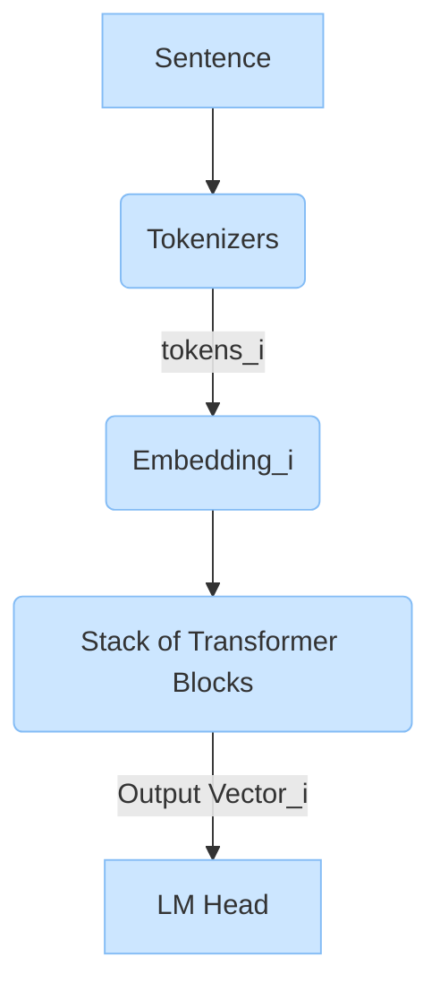
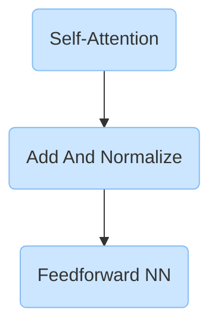
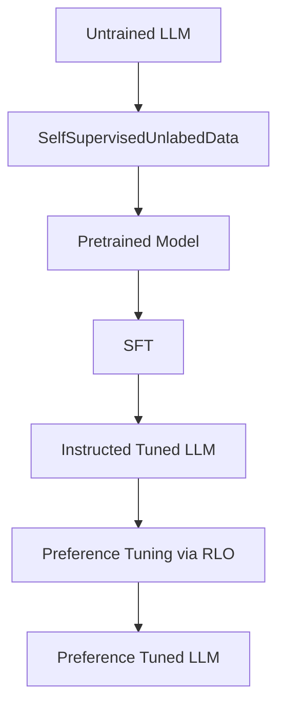

+++
title = "Hands On Large Language Model"
description = ""
+++

# Part 1: Understanding Language Models

## Chapter 1: An Introduction To LLM


## Chapter 2: Tokens And Embeddings


## Chapter 3: Looking Inside LLM

### 3.1 Overview of Transformer Models


#### 3.1.1 Inputs and Outputs of a Trained Transformer LLM
- Input: prompt + previous_generation
- Output: most probable token

- Code:
```python
import torch
from transformers import AutoModelForCausalLM, AutoTokenizer, pipeline

# Load model and tokenizer
tokenizer = AutoTokenizer.from_pretrained("microsoft/Phi-3-mini-4k-instruct")

model = AutoModelForCausalLM.from_pretrained(
    "microsoft/Phi-3-mini-4k-instruct",
    device_map="cuda",
    torch_dtype="auto",
    trust_remote_code=True,
)

# Create a pipeline
generator = pipeline(
    "text-generation",
    model=model,
    tokenizer=tokenizer,
    return_full_text=False,
    max_new_tokens=50,
    do_sample=False,
)

prompt = "Write an email apologizing to Sarah for the tragic gardening mishap. Explain how it happened."

output = generator(prompt)
```

#### 3.1.2 Components of Forward Pass
- This refers to what happens between input_prompt and output_token
    - input_prompt --> Transformer LLM (Forward Pass) --> output_token
- Components
    1. Tokenizer
        1. token --> token_id --> token embeddings
    2. Stack of Transformer Blocks
        1. block 1
        2. block n
    3. LM Head
        1. Can be: a simple NN layer, sequence classification heads, token classification heads
- Understanding a model output
```
Phi3ForCausalLM(
  (model): Phi3Model(
    (embed_tokens): Embedding(32064, 3072, padding_idx=32000)
    (embed_dropout): Dropout(p=0.0, inplace=False)
    (layers): ModuleList(
      (0-31): 32 x Phi3DecoderLayer(
        (self_attn): Phi3Attention(
          (o_proj): Linear(in_features=3072, out_features=3072, bias=False)
          (qkv_proj): Linear(in_features=3072, out_features=9216, bias=False)
          (rotary_emb): Phi3RotaryEmbedding()
        )
        (mlp): Phi3MLP(
          (gate_up_proj): Linear(in_features=3072, out_features=16384, bias=False)
          (down_proj): Linear(in_features=8192, out_features=3072, bias=False)
          (activation_fn): SiLU()
        )
        (input_layernorm): Phi3RMSNorm()
        (resid_attn_dropout): Dropout(p=0.0, inplace=False)
        (resid_mlp_dropout): Dropout(p=0.0, inplace=False)
        (post_attention_layernorm): Phi3RMSNorm()
      )
    )
    (norm): Phi3RMSNorm()
  )
  (lm_head): Linear(in_features=3072, out_features=32064, bias=False)
)
```
- lm_head output is
    - 1 row, with 6 tokens, each token being 32064 bits long
- This shows us the various nested layers of the model. The majority of the model is labeled model, followed by lm_head.
- Inside the Phi3Model model, we see the embeddings matrix embed_tokens and its dimensions. It has 32,064 tokens each with a vector size of 3,072.
- Skipping the dropout layer for now, we can see the next major component is the stack of Transformer decoder layers. It contains 32 blocks of type Phi3DecoderLayer.
- Each of these Transformer blocks includes an attention layer and a feedforward neural network (also known as an mlp or multilevel perceptron). We’ll cover these in more detail later in the chapter.
- Finally, we see the lm_head taking a vector of size 3,072 and outputting a vector equivalent to the number of tokens the model knows. That output is the probability score for each token that helps us select the output token.


#### 3.1.3 Choosing a Single Token From the Probability Distribution (Sampling/Decoding)
- Code
```python
prompt = "The capital of France is"

# Tokenize the input prompt
input_ids = tokenizer(prompt, return_tensors="pt").input_ids

# Tokenize the input prompt
input_ids = input_ids.to("cuda")

# Get the output of the model before the lm_head
model_output = model.model(input_ids)

# Get the output of the lm_head
lm_head_output = model.lm_head(model_output[0])

# lm_head_output is of the shape [1, 6, 32064] (from model output before). We can access the token probability scores for the last generated token using lm_head_output[0,-1], which uses the index 0 across the batch dimension; the index –1 gets us the last token in the sequence. This is now a list of probability scores for all 32,064 tokens. We can get the top scoring token ID, and then decode it to arrive at the text of the generated output token:
token_id = lm_head_output[0,-1].argmax(-1)
tokenizer.decode(token_id)
# PARIS


```


#### 3.1.4 Parallel Token Processing and Context Size
- LLM is highly parallelized
    - each token_i in the context window (ie 4k tokens) is a parallel stream to the tokenizer --> transformer block --> LLM head --> output_i_vector!!!
- For text generation, only the ==last output vector== (ie most current token) is used to generate the probability of next token
- Example
    - If you’re following along with the code examples, recall that the output of lm_head was of the shape [1, 6, 32064]. That was because the input to it was of the shape [1, 6, 3072], which is a batch of one input string, containing six tokens, each of them represented by a vector of size 3,072 corresponding to the output vectors after the stack of Transformer blocks.

```python
model_output[0].shape
#torch.Size([1, 6, 3072])

lm_head_output
torch.Size([1, 6, 32064])

```


#### 3.1.5 Speeding Up Generation By Caching Keys and values
- Remember, we use only the last output vector to generate the next token
    - If we give the model the ability to cache the results of the previous calculation (especially some of the specific vectors in the attention mechanism), we no longer need to repeat the calculations of the previous streams

- Code
```python
prompt = "Write a very long email apologizing to Sarah for the tragic gardening mishap. Explain how it happened."
# Tokenize the input prompt
input_ids = tokenizer(prompt, return_tensors="pt").input_ids
input_ids = input_ids.to("cuda")

# returns 4.5 sec
%%timeit -n 1
# Generate the text
generation_output = model.generate(
  input_ids=input_ids,
  max_new_tokens=100,
  use_cache=True
)

# returns 21.8 sec
%%timeit -n 1
# Generate the text
generation_output = model.generate(
  input_ids=input_ids,
  max_new_tokens=100,
  use_cache=False
)

```

#### 3.1.6 Inside the Transformer Block
- Let's expand the block of transformer in the previous LLM diagram
- Each transformer block in the transformer stack contains 2 parts: self-attention and feedforward NN.

  ```mermaid
  
  flowchart TD
      A(Self-Attention) -->B(Feedforward NN)
      classDef default fill:#CCE6FF,stroke:#84BCF5,textColor:#1C2B33,fontFamily:trebuchet ms;
  ```

##### Feedforward NN At a Glance
- The feedforward NN is how we remember, and extrapolate patterns in our corpus/data.
    - Memorization is only one ingredient in the recipe of impressive text generation. The model is able to use this same machinery to interpolate between data points and more complex patterns to be able to generalize
-
##### Attention Layer At a Glance
- self-attention updates the current output vector with the other previous token output vectors, normalized by the (query) (key) matrix.
- self-attention is the ==mechanism== to  incorporate relevant information from the context into the vector it produces as the output for that position.
- High level, self attention
    1. relevance scoring of current token to previous tokens with query and key matrix multiplication
    2. Combine the information with a sum_of_previous_tokens( score_relevance * output_vector_i)
- Details
    1. The attention layer (of a generative LLM) is processing attention for a single position.
    2. The inputs to the layer are:
        1. The vector representation of the current position or token
        2. The vector representations of the previous tokens
    3. The goal is to produce a new representation of the current position that incorporates relevant information from the previous tokens:
        1. For example, if we’re processing the last position in the sentence “Sarah fed the cat because it,” we want “it” to represent the cat—so attention bakes in “cat information” from the cat token.
    4. The training process produces three projection matrices that produce the components that interact in this calculation:
        1. A query projection matrix
        2. A key projection matrix
        3. A value projection matrix
- Attention starts by multiplying the inputs by the projection matrices to create three new matrices. These are called the queries, keys, and values matrices. These matrices contain the information of the input tokens projected to three different spaces that help carry out the two steps of attention:
- This is ==multi-head== self attention because
    - each token has its own head AND (query and key) matrix.


### 3.2 Recent Improvements In Architecture
#### 3.2.1 More Efficient Attention
##### Local/Sparse Attention
- Sparse attention limits the context of previous tokens that the model can attend to
- The GPT-3 architecture interweaved full-attention and efficient-attention Transformer blocks

##### Multi-query
- All the previous tokens_i and current_token share the same key matrix, and only outputs 1 value matrix as opposed to the multi-head self attention scheme

##### Flash Attention
- Improves attention calculation by moving values between a GPU’s shared memory (SRAM) and high bandwidth memory (HBM)

#### 3.2.2 The Transformer Block
##### Add and Normalization Layer


- There are different normalization techniques, to help with training
    - This has been reported to reduce the required training time (read: “On layer normalization in the Transformer architecture”). Another improvement in normalization here is using RMSNorm, which is simpler and more efficient than the LayerNorm used in the original Transformer (read: “Root mean square layer normalization”). Lastly, instead of the original Transformer’s ReLU activation function, newer variants like SwiGLU (described in “GLU Variants Improve Transformer”) are now more common.


#### 3.2.3 Positional Embeddings (RoPE)
- Positional embeddings enables the model to keep track of the order of tokens/words in a sequence/sentence, which is an indispensable source of information in language
    - Unlike traditional sequential models like RNNs or LSTMs, **transformers** (the architecture behind most modern LLMs like GPT and BERT) do not have an inherent sense of position since they process all input tokens in parallel.
- Positional embeddings are added to the token embeddings.

#### 3.2.3 Other Architectural Experiments and Improvements


# Part 2: Using Pretrained Language Models

## Chapter 4: Text Classification
- We will achieve text classification with 2 methods
    1. Representation Language Models
        1. input: text
        2. output: class, ie 0, 1
    2. Generative Model
        1. input: prompt
        2. output: a sentence
### 4.1 Sentiment of Movie Reviews
- Code
```python
from datasets import load_dataset

# Load our data
data = load_dataset("rotten_tomatoes")

data
DatasetDict({
    train: Dataset({
        features: ['text', 'label'],
        num_rows: 8530
    })
    validation: Dataset({
        features: ['text', 'label'],
        num_rows: 1066
    })
    test: Dataset({
        features: ['text', 'label'],
        num_rows: 1066
    })
})

# training data, last sample
data["train"][0, -1]
{'text': ['the rock is destined to be the 21st century\'s new " conan " and that he\'s going to make a splash even greater than arnold schwarzenegger , jean-claud van damme or steven segal .',
  'things really get weird , though not particularly scary : the movie is all portent and no content .'],
 'label': [1, 0]} # 1=positive; 0=negative

```


### 4.2 Text Classification with Representation Models
- We can fine-tune BERT encoder (foundational model) for either
    1. specific task (Chapter 11)
    2. create embeddings, which we can use to train a logistic classifier or semantic search (Chapter 12)
- In this chapter, just use the pretrained task specific model for our task from huggingface

### 4.3 Model Selection
- Bert is a encoder only architecture for creating task specific and embedding models
- For embeddings, use the MTEB leaderboard as a starting point
- Good solid baselines:
    - BERT base model (uncased)
    - RoBERTa base model
    - DistilBERT base model (uncased)
    - DeBERTa base model
    - bert-tiny
    - ALBERT base v2

### 4.4 Using a Task Specific Models
- Create tokenizer, model pipeline
```python
from transformers import pipeline

# Path to our HF model
model_path = "cardiffnlp/twitter-roberta-base-sentiment-latest"

# Load model into pipeline
pipe = pipeline(
    model=model_path,
    tokenizer=model_path,
    return_all_scores=True,
    device="cuda:0"
)
```

- Split and Inference and Evaluation
```python
import numpy as np
from tqdm import tqdm
from transformers.pipelines.pt_utils import KeyDataset
# Run inference
y_pred = []
for output in tqdm(pipe(KeyDataset(data["test"], "text")), total=len(data["test"])):
    negative_score = output[0]["score"]
    positive_score = output[2]["score"]
    assignment = np.argmax([negative_score, positive_score])
    y_pred.append(assignment)


from sklearn.metrics import classification_report
def evaluate_performance(y_true, y_pred):
    """Create and print the classification report"""
    performance = classification_report(
        y_true, y_pred,
        target_names=["Negative Review", "Positive Review"]
    )
    print(performance)


evaluate_performance(data["test"]["label"], y_pred)
                precision    recall  f1-score   support
Negative Review       0.76      0.88      0.81       533
Positive Review       0.86      0.72      0.78       533

       accuracy                           0.80      1066
      macro avg       0.81      0.80      0.80      1066
   weighted avg       0.81      0.80      0.80      1066

```


### 4.5 Classification tasks That Leverage Embeddings
- Assuming there are no model specific task model that matches our use case, we don't have to fine the finetune the bert or training a LM head. One option is to use the embeddings from bert to train a simple logistic regression classifier.
    - Benefit: cheaper inference and does not require GPU

- Code: load embeddings
```python
from sentence_transformers import SentenceTransformer

# Load model
model = SentenceTransformer("sentence-transformers/all-mpnet-base-v2")

# Convert text to embeddings
train_embeddings = model.encode(data["train"]["text"], show_progress_bar=True)
test_embeddings = model.encode(data["test"]["text"], show_progress_bar=True)

train_embeddings.shape
(8530, 768)


```


- Code: Train classifier + evaluation
```python
from sklearn.linear_model import LogisticRegression

# Train a logistic regression on our train embeddings
clf = LogisticRegression(random_state=42)
clf.fit(train_embeddings, data["train"]["label"])

# Predict previously unseen instances
y_pred = clf.predict(test_embeddings)
evaluate_performance(data["test"]["label"], y_pred)


```

##### What If We Don't Hav Labeled Data?
- Look into ==zero-shot== classification
    - Zero-shot classification attempts to predict the labels of input text even though it was not trained on them,

- Here, we use embeddings to achieve zero shot
    1. e_input = embed(text_review)
    2. e_neg = emebd("This is a negative review")
    3. e_pos = embed("This is a positive review")
    4. np.argmax(cos_sim(e_input, e_pos), cos_sim(e_input, e_neg))

- Code
```python
# Create embeddings for our labels
label_embeddings = model.encode(["A negative review",  "A positive review"])


# Find the best matching label for each document
from sklearn.metrics.pairwise import cosine_similarity
sim_matrix = cosine_similarity(test_embeddings, label_embeddings)
y_pred = np.argmax(sim_matrix, axis=1)


evaluate_performance(data["test"]["label"], y_pred)
# achieves a f1-score of 0.78 !!! The task specific model above was 0.85
```

### 4.6 Text Classification with Generative Models
- Since generative model are sequence to sequence model trained on a wide variety of tasks and output class, we need to guide it (with prompt engineering)
    - Example prompts
        - bad: Rate the sentiment: "Best movie ever"
        - better: Is this movie review negative or positive: "Best movie ever"
##### Using the Text to Text Transformer
- Book explored mostly encoder-only (representation) models like BERT and decoder-only (generative) models like ChatGPT. However, as discussed in Chapter 1, the original Transformer architecture actually consists of an encoder-decoder architecture
- T5 model (aka Text to Text Transformer)
    -  This is encoder - decoder architecture that is trained across ==many many tasks==
    - Training
        - 1st stage:  masked language modeling; but instead of predicting a missing token, it predicts a ==sequence of tokens==
        - 2nd stage:
            - each task is converted to a sequence to sequence task, and trained simultaneously
            - Ex input --> output:
                - Task: Translation
                    - Input: Translate into Dutch: My name is Maarten
                    - Output: Mijn naam is Maarten
                - Task: Grammar:
                    - input: the building is tall and wide
                    - output: acceptable
- Code:
```python
pipe = pipeline(
    "text2text-generation", 
    model="google/flan-t5-small", 
    device="cuda:0"
)

# Prepare our data
prompt = "Is the following sentence positive or negative? "
data = data.map(lambda example: {"t5": prompt + example['text']})
data
DatasetDict({
    train: Dataset({
        features: ['text', 'label', 't5'],
        num_rows: 8530
    })
    validation: Dataset({
        features: ['text', 'label', 't5'],
        num_rows: 1066
    })
    test: Dataset({
        features: ['text', 'label', 't5'],
        num_rows: 1066
    })
})


# Run inference
y_pred = []
for output in tqdm(pipe(KeyDataset(data["test"], "t5")), total=len(data["test"])):
    text = output[0]["generated_text"]
    y_pred.append(0 if text == "negative" else 1)

evaluate_performance(data["test"]["label"], y_pred)

```


##### ChatGPT for Classification (Closed Model)
- How was ChatGPT trained? (OpenAI [documentation](https://openai.com/index/chatgpt/))
    1. Supervised Fine Tuning (Instruction tuning?)
        - Prompt --> Labeler
            - train a fine-tuned GPT
    2. Train Reward Model via PPO (Proximal Policy Optimization)
        1. Use SFT model to generate answers to prompt. Have a human labeler order the answer
    3. Optimize a plicy against the reward model using PPO reinforcement learning algorithm
- Code to use ChatGPT for Classification (f1 score of 0.91)

```python

# -----------------------------------------------------------# # # # # Create client
# -----------------------------------------------------------
import openai
client = openai.OpenAI(api_key="YOUR_KEY_HERE")

# -----------------------------------------------------------# Chat # Generation
# -----------------------------------------------------------
def chatgpt_generation(prompt, document, model="gpt-3.5-turbo-0125"):
    """Generate an output based on a prompt and an input document."""
    messages=[
        {
            "role": "system",
            "content": "You are a helpful assistant."
            },
        {
            "role": "user",
            "content":   prompt.replace("[DOCUMENT]", document)
            }
    ]
    chat_completion = client.chat.completions.create(
      messages=messages,
      model=model,
      temperature=0
    )
    return chat_completion.choices[0].message.content

# -----------------------------------------------------------
# Prompt Engineering + Inference
# -----------------------------------------------------------
# Define a prompt template as a base
prompt = """Predict whether the following document is a positive or negative movie review:

[DOCUMENT]

If it is positive return 1 and if it is negative return 0. Do not give any other answers.
"""
# Predict the target using GPT
document = "unpretentious , charming , quirky , original"
chatgpt_generation(prompt, document)


# -----------------------------------------------------------
# Evaluation
# -----------------------------------------------------------
# You can skip this if you want to save your (free) credits
predictions = [
    chatgpt_generation(prompt, doc) for doc in tqdm(data["test"]["text"])
]
# Extract predictions
y_pred = [int(pred) for pred in predictions]

# Evaluate performance
evaluate_performance(data["test"]["label"], y_pred)

```


## Chapter 5: Text Clustering and Topic Modeling
### 5.1 Overview
- Text clustering is an unsupervised technique
    - groups text based on semantic content, meaning, and relationships
    - LLM has proven useful for: finding outliers, labeling speedups, and finding incorrect labels
        - more traditional approaches treat language as bag of words
- Topic clustering is a subtype of text clustering, where we want to discover the topic in large collection of textual data
- Chapter:
    - first clustering with embedding models
    - then clustering with LLM (BertTopic)

### 5.2 Dataset: ArXiv Articles
- Code
```python

# Load data from Hugging Face
from datasets import load_dataset
dataset = load_dataset("maartengr/arxiv_nlp")["train"]

# Extract metadata
abstracts = dataset["Abstracts"]
titles = dataset["Titles"]
```

### 5.3 Common Pipeline for Text Clustering
- Section explores using embedding approach to text cluster
    1. Convert document to embeddings
    2. Reduce embedding dimension
    3. Find group of semantically similar document with ==cluster model==
- Other text clustering approaches
    - graph based neural network
    - centroid based clustering
- Code
```python
# --------------------------------------
# Embed Document
# --------------------------------------
from sentence_transformers import SentenceTransformer

# Create an embedding for each abstract
embedding_model = SentenceTransformer("thenlper/gte-small")
embeddings = embedding_model.encode(abstracts,show_progress_bar=True)

embeddings.shape 
#(44949, 384) each embedding is 384 dimension


# --------------------------------------
# Reduce dimension with UMAP
# --------------------------------------
from umap import UMAP
umap_model = UMAP(
    n_components=5, min_dist=0.0, metric='cosine', random_state=42
)
reduced_embeddings = umap_model.fit_transform(embeddings)


# --------------------------------------
# Cluster the Reduced Embeddings with HDBSCAN
# --------------------------------------
from hdbscan import HDBSCAN

# We fit the model and extract the clusters
hdbscan_model = HDBSCAN(
    min_cluster_size=50, metric="euclidean", cluster_selection_method="eom"
).fit(reduced_embeddings)
clusters = hdbscan_model.labels_

# How many clusters did we generate? 156
len(set(clusters))


# --------------------------------------
# Inspect Clusters
# --------------------------------------
import numpy as np
import pandas as pd
import matplotlib.pyplot as plt

# (1) Print first three documents in cluster 0
cluster = 0
for index in np.where(clusters==cluster)[0][:3]:
    print(abstracts[index][:300] + "... \n")

# (2) Visualize results
# Reduce 384-dimensional embeddings to 2 dimensions for easier visualization
reduced_embeddings = UMAP(
    n_components=2, min_dist=0.0, metric="cosine", random_state=42
).fit_transform(embeddings)

# Create dataframe
df = pd.DataFrame(reduced_embeddings, columns=["x", "y"])
df["title"] = titles
df["cluster"] = [str(c) for c in clusters]

# Select outliers and non-outliers (clusters)
to_plot = df.loc[df.cluster != "-1", :]
outliers = df.loc[df.cluster == "-1", :]


# (3) Plot

# Plot outliers and non-outliers separately
plt.scatter(outliers_df.x, outliers_df.y, alpha=0.05, s=2, c="grey")
plt.scatter(
    clusters_df.x, clusters_df.y, c=clusters_df.cluster.astype(int),
    alpha=0.6, s=2, cmap="tab20b"
)
plt.axis("off")


```

### 5.4 From Text Clustering to Topic Modeling
- Topic modeling finds themes or latent topics in a collection of textual data is often referred to as topic modeling.
    - Traditional approaches uses bag of word (BOW) approach. Dirichlet allocation, assume that each topic is characterized by a probability distribution of words in a corpus’s vocabulary
        - BOW does not take into account context, word meaning, or phrases into account
#### BertTopic: A modular Topic Modeling Framework
-  the [documentation](https://maartengr.github.io/BERTopic/) or the [github repository](https://github.com/MaartenGr/BERTopic).
    - 2 Steps
        - Step 1: embed with SBERT, reduce dimension with UMAP, and cluster with HDBSCAN
            - same as in the previous common pipeline
        - Step2: it models a distribution over words in the corpus’s vocabulary by leveraging a classic method, namely bag-of-words
            - Uses Inverse Document Frequency (IDF) to rank the word
- Code:
```python
from bertopic import BERTopic

# Train our model with our previously defined models
topic_model = BERTopic(
	embedding_model=embedding_model,
	umap_model=umap_model,
	hdbscan_model=hdbscan_model,
	verbose=True
).fit(abstracts, embeddings)

# Print all the topics found
topic_model.get_topic_info()

# print the key words and score in topic 0
topic_model.get_topic(0)

# print all topics ids related to pickleball
topic_model.find_topics('pickleball)

# Visualize topics and documents
fig = topic_model.visualize_documents(
	titles, 
	reduced_embeddings=reduced_embeddings, 
	width=1200, 
	hide_annotations=True
)

# Update fonts of legend for easier visualization
fig.update_layout(font=dict(size=16))
```

- Let's improve bertTopic framework by replacing it's BOW ranking with a 2nd round ranker, referred in BertTopic as representation model. This reranker is used to better describe each topic
    - tf-idf --> reranker (==KeyBert==)

- Code 1: Utility
```python
# Save original representations
from copy import deepcopy
original_topics = deepcopy(topic_model.topic_representations_)

# Show the differences in topic representations between two models
def topic_differences(model, original_topics, nr_topics=5): 
    df = pd.DataFrame(columns=["Topic", "Original", "Updated"])
    for topic in range(nr_topics):

        # Extract top 5 words per topic per model
        og_words = " | ".join(list(zip(*original_topics[topic]))[0][:5])
        new_words = " | ".join(list(zip(*model.get_topic(topic)))[0][:5])
        df.loc[len(df)] = [topic, og_words, new_words]
    
    return df
```

- Code 2: Integrate KeyBert (phase 1)
```python

from bertopic.representation import KeyBERTInspired

# Update our topic representations using KeyBERTInspired
representation_model = KeyBERTInspired()
topic_model.update_topics(abstracts, representation_model=representation_model)

# Show topic differences; but the updated has lots of repeats
topic_differences(topic_model, original_topics)

```

- Code 3: Improve on code 2 by reducing/controlling the diversity with ==maximal marginal relevance==(MMR)
    - The algorithm attempts to find a set of keywords that are diverse from one another but still relate to the documents they are compared to. It does so by embedding a set of candidate keywords and iteratively calculating the next best keyword to add. Doing so requires setting a diversity parameter, which indicates how diverse keywords need to be.
```python
from bertopic.representation import MaximalMarginalRelevance

# Update our topic representations to MaximalMarginalRelevance
representation_model = MaximalMarginalRelevance(diversity=0.2)
topic_model.update_topics(abstracts, representation_model=representation_model)

# Show topic differences
topic_differences(topic_model, original_topics)
```


## Chapter 6: Prompt Engineering
### 6.1 Using Text Generation Models
- Code
```python

import torch
from transformers import AutoModelForCausalLM, AutoTokenizer, pipeline

# Load model and tokenizer
model = AutoModelForCausalLM.from_pretrained(
    "microsoft/Phi-3-mini-4k-instruct",
    device_map="cuda",
    torch_dtype="auto",
    trust_remote_code=True,
)
tokenizer = AutoTokenizer.from_pretrained("microsoft/Phi-3-mini-4k-instruct")

# Create a pipeline
pipe = pipeline(
    "text-generation",
    model=model,
    tokenizer=tokenizer,
    return_full_text=False,
    max_new_tokens=500,
    do_sample=False,
)

# Prompt
messages = [
    {"role": "user", "content": "Create a funny joke about chickens."}
]

# Apply prompt template: template matches the instruction used during this particular model's training
prompt = pipe.tokenizer.apply_chat_template(messages, tokenize=False)
print(prompt)
#<s><|user|>
#Create a funny joke about chickens.<|end|>
#<|assistant|>

# Generate the output
output = pipe(messages)
print(output[0]["generated_text"])

```

##### Controlling Model Output
- Temperature
    - Controls randomness/creativity of response
        - 0 --> same response every time by choosing the most likely word
        -  0.8; higher --> less probable word are more likely to appear
- Top_p (aka nucleus sampling)
    - Nucleus sampling is a technique that controls which set of tokens LLM considers
        - 1 --> consider all tokens
        - 0.1 --> consider tokens which has a score of 0.1
- Top_k
    - controls how many topK tokens LLM consider for output candidate


### 6.2 Intro to Prompt Engineering


### 6.3 Advanced Prompt Engineering


### 6.4 Reasoning with Generative Models


### 6.5 Output Verifications

first.   last
young.  old

M L  R
_ M   R. L

## Chapter 7: Advanced Text Generation Techniques and Tools


## Chapter 8: Semantic Search and Retrieval Augmented Generation


## Chapter 9: MultiModal LLM


- You cannot create value if you don't interact with people
    - understand how they tick; what are their needs, what are their limiting factors, what do they want to do?


# Part 3: Training And Fine Tuning LM
## Chapter 10: Creating Text Embedding Models

### 10.1 Embedding Models
- Embedding is a representation of our corpus

- What is a good representation?
    - One that can capture the semantic nature of our document;
        - simplistic way of looking at it: similar document word appears in the similar vector space


- Detail: Semantic vs Syntax nature
    - Semantic refers to meaning and understanding that focuses on words, phrases, and sentences.
        - **Meaning Representation**: The primary concern is capturing the _meaning_ of a sentence, word, or text. For example, understanding that "the cat is on the mat" refers to a cat being physically on a mat.

        - **Contextual Understanding**: Semantics in NLP often involves **contextual meaning**, where the same word or phrase can have different meanings depending on the surrounding text (e.g., "bank" could mean a financial institution or the side of a river).

        - **Intent and Inference**: LLMs leverage semantic understanding to infer the **intent** behind a sentence or question, like understanding that "Can you pass the salt?" is a polite request, not a literal query about someone's ability.

        - **Conceptual Relations**: Semantics involves understanding the **relationships** between different concepts, such as understanding that "doctor" and "hospital" are conceptually related, or recognizing that "running fast" describes a quick pace of movement.

    - Semantic does ==NOT== mean:
        - **Syntax or Grammar**: Semantic nature does not concern itself with the _rules_ of language structure (like grammar or syntax). For example, it doesn't focus on whether a sentence is grammatically correct but rather on what it conveys.

        - **Surface Forms**: It doesn't involve the direct form of words (such as their spelling or phonetic properties) but rather their meaning. For instance, in semantics, "run" and "running" are variations of the same action.

        - **Exact Literal Translation**: It’s not about **word-for-word** translation or definitions. Instead, it's about capturing the _intended meaning_, which can sometimes be idiomatic or metaphorical (e.g., "kick the bucket" meaning "to die").

        - **Simple Pattern Matching**: It does not involve recognizing patterns in the raw text that are purely based on the appearance of words, such as keyword matching. Semantic nature requires **understanding beyond mere keywords**, focusing instead on deeper meaning and intent.


- Shallow Statistical Models vs LLM
    - N-gram models are **shallow** statistical models, meaning they only consider the **probability** of word sequences without explicitly understanding the grammatical rules that govern language. Therefore, they do capture some surface-level syntax in terms of word order, but they lack the ability to model more complex grammatical structures and dependencies.
    - In contrast, modern models like **transformers** capture both **syntax** and **semantics**, largely due to the **self-attention mechanism**.

- How Transformers Captures Semantics and Syntax
    - How Transformers Capture **Syntax**:
        - **Long-Range Dependencies**: The self-attention mechanism allows transformers to look at **all words in a sentence simultaneously**, regardless of their distance from each other. This enables transformers to handle **long-range dependencies** like subject-verb agreement or nested clauses (e.g., "The boy who is running fast is tired").

        - **Hierarchical Structures**: Attention enables transformers to **weigh the importance** of different words relative to each other, which helps capture complex grammatical relationships (e.g., distinguishing between main and subordinate clauses, or identifying the subject of a sentence even when it’s far from the verb).

        - **Context-Sensitive Word Relationships**: Transformers can determine how words in a sentence depend on each other in a **context-sensitive** way. For example, in the sentence "He gave her the book," the model can figure out that "he" is the subject, "her" is the indirect object, and "book" is the direct object, even though their relationships are not adjacent.

    - How Transformers Capture **Semantics**:
        - **Contextualized Representations**: With attention, transformers create **contextual embeddings**, meaning the same word can have different meanings depending on its surrounding words. For example, in "He went to the bank to deposit money" vs. "She sat on the river bank," the transformer can assign different meanings to "bank" based on context.

        - **Global Context**: The self-attention mechanism allows the model to attend to **relevant words** in the sentence, regardless of their position. This is crucial for understanding the **overall meaning** of a sentence. For instance, it helps the model capture relationships like synonymy (words with similar meanings), antonymy (opposites), or topic coherence.

        - **Intent and Disambiguation**: Because transformers can examine all words in a sequence and weigh their importance, they can better understand **intent** and disambiguate meanings. For example, it can distinguish between different senses of the same word ("apple" as a fruit vs. the tech company) by paying attention to surrounding context.


		### Role of Self-Attention:
		
		- **Parallel Processing**: Unlike sequential models (like RNNs), where information is processed word-by-word in order, transformers look at the entire sentence at once. The self-attention mechanism assigns **weights** to words, determining which words are most relevant to each other for a given task (whether it's understanding grammatical structure or semantic meaning).
		    
		- **Dynamic Relationships**: Self-attention dynamically computes relationships between words in every layer of the transformer model. This means the model can capture not only **word order and proximity** (which aids in syntax) but also **semantic relationships** across the entire input.

### 10.2 Contrastive Learning
- Contrastive Learning is a technique used to learn effective representations by teaching the model to differentiate between similar and dissimilar data points. The model is trained to bring **similar instances closer** in the embedding space and **push dissimilar ones apart**.

- Example:
    - S1: cat is sleeping on the sofa
    - S2: feline is resting on the couch
    - S3: car driving on the road
    - embedding_s1 and embedding_s2 are closer

- Contrastive Loss Function
  $$L_contrastive​=−log(\sum_{k=1}^N​exp(sim(h_i​,h_k​)/τ)exp(sim(hi_​,h_j​)/τ)​)$$
    - $h_i h_j$​ are the representations (embeddings) of two similar data points (positive pair).
    - $h_k$​ are the representations of negative samples (dissimilar points).
    - Similarity function (commonly cosine similarity): $$s(h_i, h_j) = \frac{h_i \cdot h_j}{\|h_i\| \|h_j\|}$$​​
    - τ\tauτ is a temperature parameter that controls the sharpness of the distribution.
    - N is the total number of negative samples in the batch.


### 10.3 SBERT
- sentence-transformers uses contrastive learning
    - improves upon BERT
        - uses contrastive learning
        - more efficient computation
        - Good for uses cases like: semantic search, clustering, and paragraph detection


### 10.4 Creating an Embedding Model
##### Generating Contrastive Examples
- Training Data Format for Natural Language Inference Using NLI TASK
    - Premise: fact that serves as the foundation for comparison in NLI tasks
    - Hypothesises
        - Is Evaluated in relation to the premise; Is the hypothesis true or false or neutral given the premise?
    - labels
        - True -->  aka entailment
        - False --> contradiction
        - Netural
- Example
    - **Premise**: "The cat is sleeping on the sofa."
    - **Hypothesis**: "The cat is resting comfortably."
    - the premise and hypothesis can be treated as **positive pairs** (e.g., entailment) or **negative pairs** (e.g., contradiction) for training the model to differentiate between semantically similar and dissimilar sentences.
        - ("The Cate is sleeping on the sofa", "the cat is resting comfortably", Entailment)

- Code
```python
from datasets import load_dataset

# Load MNLI dataset from GLUE
# 0 = entailment, 1 = neutral, 2 = contradiction
train_dataset = load_dataset("glue", "mnli", split="train"
).select(range(50_000))
train_dataset = train_dataset.remove_columns("idx")

dataset[2]
{
	 'premise': 'One of our number will carry out your instructions minutely.',
	 
	 'hypothesis': 'A member of my team will execute your orders with immense precision.',
	 
	 'label': 0
 }
 
```

##### Train Models
- Code
```python
# Use a base model
from sentence_transformers import SentenceTransformer
embedding_model = SentenceTransformer('bert-base-uncased')

# Define the loss function. In softmax loss, we will also need to explicitly set the number of labels.
# We will use softmas here; later in next section we explore how to use other more performant loss function
from sentence_transformers import losses
train_loss = losses.SoftmaxLoss(
	model=embedding_model,
	sentence_embedding_dimension= 
		embedding_model.get_sentence_embedding_dimension(),
	num_labels=3
)

# Use Semantic Textual Similarity Benchmark to Evaluate Performance
from sentence_transformers.evaluation import EmbeddingSimilarityEvaluator
val_sts = load_dataset("glue", "stsb", split="validation")
evaluator = EmbeddingSimilarityEvaluator(
    sentences1=val_sts["sentence1"],
    sentences2=val_sts["sentence2"],
    scores=[score/5 for score in val_sts["label"]],
    main_similarity="cosine",
)

# Define arguments
from sentence_transformers.training_args import SentenceTransformerTrainingArguments
args = SentenceTransformerTrainingArguments(
    output_dir="base_embedding_model",
    num_train_epochs=1,
    per_device_train_batch_size=32,
    per_device_eval_batch_size=32,
    warmup_steps=100,
    fp16=True,
    eval_steps=100,
    logging_steps=100)

# Define Trainer and train
from sentence_transformers.trainer import SentenceTransformerTrainer
trainer = SentenceTransformerTrainer(
    model=embedding_model,
    args=args,
    train_dataset=train_dataset,
    loss=train_loss,
    evaluator=evaluator
)
trainer.train()

# Evaluate our trained model
evaluator(embedding_model)
{'pearson_cosine': 0.5982288436666162,
 'spearman_cosine': 0.6026682018489217,
 'pearson_manhattan': 0.6100690915500567,
 'spearman_manhattan': 0.617732600131989,
 'pearson_euclidean': 0.6079280934202278,
 'spearman_euclidean': 0.6158926913905742,
 'pearson_dot': 0.38364924527804595,
 'spearman_dot': 0.37008497926991796,
 'pearson_max': 0.6100690915500567,
 'spearman_max': 0.617732600131989}
```

- Training Args
    - `num_train_epochs`
        - The number of training rounds. We keep this at 1 for faster training but it is generally advised to increase this value.

    - `per_device_train_batch_size`
        - The number of samples to process simultaneously on each device (e.g., GPU or CPU) during training. Higher values generally means faster training.

    - `per_device_eval_batch_size`
        - The number of samples to process simultaneously on each device (e.g., GPU or CPU) during evaluation. Higher values generally means faster evaluation.

    - `warmup_steps`
        - The number of steps during which the learning rate will be linearly increased from zero to the initial learning rate defined for the training process. Note that we did not specify a custom learning rate for this training process.

    - `fp16`
        - By enabling this parameter we allow for mixed precision training, where computations are performed using 16-bit floating-point numbers (FP16) instead of the default 32-bit (FP32). This reduces memory usage and potentially increases the training speed.


##### In Depth Evaluation
- Let's try the Massive Text Embedding Benchmark, which has 8 tasks to cover 58 datasets and 112 languages
- Code
```python

from mteb import MTEB

# Choose evaluation task
evaluation = MTEB(tasks=["Banking77Classification"])

# Calculate results
results = evaluation.run(model)

{'Banking77Classification': {'mteb_version': '1.1.2',
 'dataset_revision': '0fd18e25b25c072e09e0d92ab615fda904d66300',
 'mteb_dataset_name': 'Banking77Classification',
 'test': {'accuracy': 0.4926298701298701,
 'f1': 0.49083335791288685,
 'accuracy_stderr': 0.010217785746224237,
 'f1_stderr': 0.010265814957074591,
 'main_score': 0.4926298701298701,
 'evaluation_time': 31.83}}}
```


##### Loss Function
- We will explore using 2 other loss functions, cosine similarity and multiple negatives ranking (MNR) loss

###### Cosine Similarity Loss
- Code
```python
# ------------------------------------
# Load MNLI dataset from GLUE
# ------------------------------------
from datasets import Dataset, load_dataset

# 0 = entailment, 1 = neutral, 2 = contradiction
train_dataset = load_dataset(
    "glue", "mnli", split="train"
).select(range(50_000))
train_dataset = train_dataset.remove_columns("idx")

# (neutral/contradiction)=0 and (entailment)=1
mapping = {2: 0, 1: 0, 0:1}
train_dataset = Dataset.from_dict({
    "sentence1": train_dataset["premise"],
    "sentence2": train_dataset["hypothesis"],
    "label": [float(mapping[label]) for label in train_dataset["label"]]
})


# ------------------------------------
# Create Evaluator
# ------------------------------------
from sentence_transformers.evaluation import EmbeddingSimilarityEvaluator

# Create an embedding similarity evaluator for stsb
val_sts = load_dataset("glue", "stsb", split="validation")
evaluator = EmbeddingSimilarityEvaluator(
    sentences1=val_sts["sentence1"],
    sentences2=val_sts["sentence2"],
    scores=[score/5 for score in val_sts["label"]],
    main_similarity="cosine"
)


# ------------------------------------
# Select a Different Loss Function
# ------------------------------------
from sentence_transformers import losses, SentenceTransformer
from sentence_transformers.trainer import SentenceTransformerTrainer
from sentence_transformers.training_args import SentenceTransformerTrainingArguments

# Define model
embedding_model = SentenceTransformer("bert-base-uncased")

# Loss function
train_loss = losses.CosineSimilarityLoss(model=embedding_model)

# Define the training arguments
args = SentenceTransformerTrainingArguments(
    output_dir="cosineloss_embedding_model",
    num_train_epochs=1,
    per_device_train_batch_size=32,
    per_device_eval_batch_size=32,
    warmup_steps=100,
    fp16=True,
    eval_steps=100,
    logging_steps=100,
)

# Train model
trainer = SentenceTransformerTrainer(
    model=embedding_model,
    args=args,
    train_dataset=train_dataset,
    loss=train_loss,
    evaluator=evaluator
)
trainer.train()


```


###### Multiple Negative Ranking Loss
- Is a loss that uses either positive pairs of sentences or triplets that contain a pair of positive sentences and an additional unrelated sentence. This unrelated sentence is called a negative and represents the dissimilarity between the positive sentences.
- Has the same intention as triplet loss but achieves it differently
    - **Triplet Loss**: Uses one positive and one negative per anchor, directly comparing the distances between the positive and negative samples.
    - **Multiple Negatives Ranking Loss**: Leverages multiple negatives from the batch, ranking the positive sample higher than all negatives, making it efficient for contrastive learning with large batches.
- While both are used to achieve similar goals (separating positive and negative pairs in the embedding space), **MNR loss** is more scalable and suited to scenarios where negatives come implicitly from the batch, whereas **triplet loss** focuses more on explicit negative sampling strategies.

```python

# ------------------------------------
# Load Data
# ------------------------------------
import random
from tqdm import tqdm
from datasets import Dataset, load_dataset

# # Load MNLI dataset from GLUE
mnli = load_dataset("glue", "mnli", split="train").select(range(50_000))
mnli = mnli.remove_columns("idx")
mnli = mnli.filter(lambda x: True if x["label"] == 0 else False)

# Prepare data and add a soft negative
train_dataset = {"anchor": [], "positive": [], "negative": []}
soft_negatives = mnli["hypothesis"]
random.shuffle(soft_negatives)
for row, soft_negative in tqdm(zip(mnli, soft_negatives)):
    train_dataset["anchor"].append(row["premise"])
    train_dataset["positive"].append(row["hypothesis"])
    train_dataset["negative"].append(soft_negative)
train_dataset = Dataset.from_dict(train_dataset)


# ------------------------------------
# Define Evaluator
# ------------------------------------
from sentence_transformers.evaluation import EmbeddingSimilarityEvaluator
# Create an embedding similarity evaluator for stsb
val_sts = load_dataset("glue", "stsb", split="validation")
evaluator = EmbeddingSimilarityEvaluator(
    sentences1=val_sts["sentence1"],
    sentences2=val_sts["sentence2"],
    scores=[score/5 for score in val_sts["label"]],
    main_similarity="cosine"
)


# ------------------------------------
# Same, but define MNR loss
# ------------------------------------
from sentence_transformers import losses, SentenceTransformer
from sentence_transformers.trainer import SentenceTransformerTrainer
from sentence_transformers.training_args import SentenceTransformerTrainingArguments

# Define model
embedding_model = SentenceTransformer('bert-base-uncased')

# Loss function
train_loss = losses.MultipleNegativesRankingLoss(model=embedding_model)


```
### 10.5 Fine Tuning On Embedding Models
- 
##### Supervised
- Here, we start with an existing embedding MiniLM-L6-v2 instead of the **bert-based-uncased**, and feed it with our dataset
- Everything else (evaluator, training args, etc.. ) stays the same
```python

embedding_model = SentenceTransformer('sentence-transformers/all-MiniLM-L6-v2')

```


##### Augmented SBERT
- Address fine tuning limitations of not having enough training label data. Here, we use a smaller labeled dataset to train a model_prime, then use model_prime to generate training data.

- Psuedo code
    1. Fine-tune a cross-encoder (BERT) using a small, annotated dataset (gold dataset).
    2. Create new sentence pairs.
    3. Label new sentence pairs with the fine-tuned cross-encoder (silver dataset).
    4. Train a bi-encoder (SBERT) on the extended dataset (gold + silver dataset).

- Code
```python

# ----------------------------------------
# Data Prep
# ----------------------------------------
import pandas as pd
from tqdm import tqdm
from datasets import load_dataset, Dataset
from sentence_transformers import InputExample
from sentence_transformers.datasets import NoDuplicatesDataLoader

# Prepare a small set of 10000 documents for the cross-encoder
dataset = load_dataset("glue", "mnli", split="train").select(range(10_000))
mapping = {2: 0, 1: 0, 0:1}

# Data loader
gold_examples = [
    InputExample(texts=[row["premise"], row["hypothesis"]], label=mapping[row["label"]])
    for row in tqdm(dataset)
]
gold_dataloader = NoDuplicatesDataLoader(gold_examples, batch_size=32)

# Pandas DataFrame for easier data handling
gold = pd.DataFrame(
    {
    "sentence1": dataset["premise"],
    "sentence2": dataset["hypothesis"],
    "label": [mapping[label] for label in dataset["label"]]
    }
)


# ----------------------------------------
# Train the Cross Encoder (Step1)
# ----------------------------------------
from sentence_transformers.cross_encoder import CrossEncoder

cross_encoder = CrossEncoder("bert-base-uncased", num_labels=2)
cross_encoder.fit(
    train_dataloader=gold_dataloader,
    epochs=1,
    show_progress_bar=True,
    warmup_steps=100,
    use_amp=False
)


# ----------------------------------------
# Create new setence paris (Step 2)
# ----------------------------------------
# Prepare the silver dataset by predicting labels with the cross-encoder
silver = load_dataset(
    "glue", "mnli", split="train"
).select(range(10_000, 50_000))
pairs = list(zip(silver["premise"], silver["hypothesis"]))


# ----------------------------------------
# Create silver dataset; using trained cross encoder to create trainig data (Step 3)
# ----------------------------------------
import numpy as np

output = cross_encoder.predict(
    pairs, apply_softmax=True, 
show_progress_bar=True
)
silver = pd.DataFrame(
    {
        "sentence1": silver["premise"], 
        "sentence2": silver["hypothesis"],
        "label": np.argmax(output, axis=1)
    }
)

# Combine gold + silver
data = pd.concat([gold, silver], ignore_index=True, axis=0)
data = data.drop_duplicates(subset=["sentence1", "sentence2"], keep="first")
train_dataset = Dataset.from_pandas(data, preserve_index=False)


# ----------------------------------------
# Same Evaluator AND Training Loop
# ----------------------------------------
from sentence_transformers.evaluation import EmbeddingSimilarityEvaluator

# Create an embedding similarity evaluator for stsb
val_sts = load_dataset("glue", "stsb", split="validation")
evaluator = EmbeddingSimilarityEvaluator(
    sentences1=val_sts["sentence1"],
    sentences2=val_sts["sentence2"],
    scores=[score/5 for score in val_sts["label"]],
    main_similarity="cosine"
)


from sentence_transformers import losses, SentenceTransformer
from sentence_transformers.trainer import SentenceTransformerTrainer
from sentence_transformers.training_args import SentenceTransformerTrainingArguments

# Define model
embedding_model = SentenceTransformer("bert-base-uncased")

# Loss function
train_loss = losses.CosineSimilarityLoss(model=embedding_model)

# Define the training arguments
args = SentenceTransformerTrainingArguments(
    output_dir="augmented_embedding_model",
    num_train_epochs=1,
    per_device_train_batch_size=32,
    per_device_eval_batch_size=32,
    warmup_steps=100,
    fp16=True,
    eval_steps=100,
    logging_steps=100,
)

# Train model
trainer = SentenceTransformerTrainer(
    model=embedding_model,
    args=args,
    train_dataset=train_dataset,
    loss=train_loss,
    evaluator=evaluator
)
trainer.train()

```

### 10.6 Unsupervised Learning
- Unsupervised Algorithms for Fine Tuning
    -  [Simple Contrastive Learning of Sentence Embeddings (SimCSE)](https://oreil.ly/4GCYn),[10](https://learning.oreilly.com/library/view/hands-on-large-language/9781098150952/ch10.html#ch01fn65) [Contrastive Tension (CT)](https://oreil.ly/5na_6),[11](https://learning.oreilly.com/library/view/hands-on-large-language/9781098150952/ch10.html#ch01fn66) [Transformer-based Sequential Denoising Auto-Encoder (TSDAE)](https://oreil.ly/_r6KI),[12](https://learning.oreilly.com/library/view/hands-on-large-language/9781098150952/ch10.html#ch01fn67) and [Generative Pseudo-Labeling (GPL)](https://oreil.ly/soIV_).[13](https://learning.oreilly.com/library/view/hands-on-large-language/9781098150952/ch10.html#ch01fn68)
#### Transformer-Based Sequential Denoising Auto-Encoder (TSDAE)
- Good for cross domain adaptation
    - Domain Adaptation refers to the process of adapting a model trained on a source domain (a particular type of data or task) to perform well on a different but related target domain, where the distribution of data might differ. This is particularly important in unsupervised learning, where the model may encounter new types of data after training.
    - Example
        - - **Source Sentence (General Domain)**: "The company experienced growth in the first quarter."
        - **Target Sentence (Legal Domain)**: "The aforementioned parties, herein referred to as 'the parties,' agree to the terms and conditions stated."

###### Key Components
- **Transformer Encoder-Decoder Architecture**:
    - TSDAE is built on a **transformer-based encoder-decoder architecture** (similar to models like BART and T5), which allows it to handle sequential data (like sentences or paragraphs) effectively.
    - The **encoder** compresses the input (in this case, noisy or corrupted text), and the **decoder** reconstructs the original sequence.
- **Denoising Auto-Encoder**:
    - TSDAE is a type of **denoising auto-encoder**, meaning that it is trained to reconstruct the **original input sentence** from a **corrupted version**. The corruption is applied to the input sentence in the form of **random masking**, **deletion**, or **reordering of tokens**.
    - The goal of the model is to **reconstruct the original, uncorrupted sentence**, encouraging it to learn useful representations that are robust to noise.

###### Steps
1. **Input Corruption**:
    - Given an input sentence (e.g., "The cat is sitting on the mat"), random corruption is applied. This might involve **dropping words**, **masking words**, or **shuffling** the sentence (e.g., "The ___ is sitting mat on").
    - This corrupted sentence is passed as input to the model.

2. **Encoding (Sentence Embedding Generation)**:
    - The **encoder** (a transformer-based model) takes the corrupted sentence and generates a **dense sentence embedding** (a fixed-size vector representing the sentence). This vector captures the essential meaning of the sentence, even though the input is corrupted.
    - The embedding captures semantic information, as the model needs to understand the meaning to reconstruct the original sentence.

3. **Decoding (Reconstruction)**:
    - The **decoder** takes the dense embedding and attempts to reconstruct the original, uncorrupted sentence ("The cat is sitting on the mat").
    - The model learns to effectively capture the **semantic content** of the sentence during the encoding phase, even though the input was noisy.

4. **Training Objective (Loss Function)**:
    - TSDAE uses a **reconstruction loss**, such as **cross-entropy**, to measure how well the decoder has reconstructed the original sentence. The loss is computed based on the difference between the original sentence and the model's reconstruction.
    - By minimizing this loss, the model learns to create embeddings that capture the underlying structure and meaning of the sentence, even from corrupted inputs.
###### Example
- Suppose the input sentence is: **"The quick brown fox jumps over the lazy dog."**
- After corruption: **"The ___ brown fox over lazy."**
- The encoder generates a fixed-size sentence embedding from the corrupted sentence, and the decoder reconstructs: **"The quick brown fox jumps over the lazy dog."**
- The model learns to map noisy or incomplete input sentences to a meaningful semantic representation during the encoding phase.

###### Code
```python
# ------------------------------------
# Download tokenizer used in the denoising (recovery) procedure
# ------------------------------------
import nltk
nltk.download("punkt")


# ------------------------------------
# Data Prep: create damaged sentnece from original sentence
# ------------------------------------
from tqdm import tqdm
from datasets import Dataset, load_dataset
from sentence_transformers.datasets import DenoisingAutoEncoderDataset

# Create a flat list of sentences
mnli = load_dataset("glue", "mnli", split="train").select(range(25_000))
flat_sentences = mnli["premise"] + mnli["hypothesis"]

# Add noise to our input data
damaged_data = DenoisingAutoEncoderDataset(list(set(flat_sentences)))

# Create dataset
train_dataset = {"damaged_sentence": [], "original_sentence": []}
for data in tqdm(damaged_data):
    train_dataset["damaged_sentence"].append(data.texts[0])
    train_dataset["original_sentence"].append(data.texts[1])
train_dataset = Dataset.from_dict(train_dataset)

train_dataset[0]
{'damaged_sentence': 'Grim jaws are.',
 'original_sentence': 'Grim faces and hardened jaws are not people-friendly.'}

# ------------------------------------
# Define Evaluator
# ------------------------------------
from sentence_transformers.evaluation import EmbeddingSimilarityEvaluator

# Create an embedding similarity evaluator for stsb
val_sts = load_dataset("glue", "stsb", split="validation")
evaluator = EmbeddingSimilarityEvaluator(
    sentences1=val_sts["sentence1"],
    sentences2=val_sts["sentence2"],
    scores=[score/5 for score in val_sts["label"]],
    main_similarity="cosine"
)

# ------------------------------------
# Using CLS token as pooling strategy vs mean of token embeddings
# ------------------------------------
from sentence_transformers import models, SentenceTransformer
# Create your embedding model
word_embedding_model = models.Transformer("bert-base-uncased")
pooling_model = models.Pooling(word_embedding_model.get_word_embedding_dimension(), "cls")
embedding_model = SentenceTransformer(modules=[word_embedding_model, pooling_model])

# ------------------------------------
# Define Loass Function: DenoisingAutoEncoderLoss
# Tie the parameter of both models so they share the same weights
# ------------------------------------
from sentence_transformers import losses

# Use the denoising auto-encoder loss
train_loss = losses.DenoisingAutoEncoderLoss(
    embedding_model, tie_encoder_decoder=True
)
train_loss.decoder = train_loss.decoder.to("cuda")

# ------------------------------------
# Training Args And Loop
# ------------------------------------
from sentence_transformers.trainer import SentenceTransformerTrainer
from sentence_transformers.training_args import SentenceTransformerTrainingArguments

# Define the training arguments
args = SentenceTransformerTrainingArguments(
    output_dir="tsdae_embedding_model",
    num_train_epochs=1,
    per_device_train_batch_size=16,
    per_device_eval_batch_size=16,
    warmup_steps=100,
    fp16=True,
    eval_steps=100,
    logging_steps=100,
)

# Train model
trainer = SentenceTransformerTrainer(
    model=embedding_model,
    args=args,
    train_dataset=train_dataset,
    loss=train_loss,
    evaluator=evaluator
)
trainer.train()

```


### 10.7 Summary


## Chapter 11: Fine Tuning Representation For Classification

### 11.1 Supervised Classification
- In this section, we allow both the model and the classification head to be updated during training
    - Chap 2, we only train the classification head
    - Here, we train and update the BERT model AND classification head, which is now a neural network. Both are updated together.

- Code
    - We will freeze some layers of the architecture; after we understand what the architecture looks like
```python

# -------------------------------------------------
# Load Dataset (RottenTomatoe Reviews)
# -------------------------------------------------
from datasets import load_dataset
tomatoes = load_dataset("rotten_tomatoes")
train_data, test_data = tomatoes["train"], tomatoes["test"]

# -------------------------------------------------
# Load Models
# -------------------------------------------------
from transformers import AutoTokenizer, AutoModelForSequenceClassification

model_id = "bert-base-cased" # embedding layer
model = AutoModelForSequenceClassification.from_pretrained(
    model_id, num_labels=2
)
tokenizer = AutoTokenizer.from_pretrained(model_id)


# -------------------------------------------------
# Understand the layers
# -------------------------------------------------
for name, param in model.named_parameters():
    print(name)

#12 encoders blocks with attention heads + dense network + normalization layer
bert.embeddings.word_embeddings.weight
bert.embeddings.position_embeddings.weight
bert.embeddings.token_type_embeddings.weight
bert.embeddings.LayerNorm.weight
bert.embeddings.LayerNorm.bias
bert.encoder.layer.0.attention.self.query.weight
bert.encoder.layer.0.attention.self.query.bias
...
bert.encoder.layer.11.output.LayerNorm.weight
bert.encoder.layer.11.output.LayerNorm.bias
bert.pooler.dense.weight
bert.pooler.dense.bias
classifier.weight
classifier.bias


# -------------------------------------------------
# Expermiment with Freezing different layers; use the f1 score to decide which experiment makes sense
# -------------------------------------------------
# Exp1: Freeze all the encoders
for name, param in model.named_parameters():

     # Trainable classification head
     if name.startswith("classifier"):
        param.requires_grad = True

      # Freeze everything else
     else:
        param.requires_grad = False

# Exp 2: Freeze the frist 5 encoders
# Encoder block 11 starts at index 165 and
# we freeze everything before that block
for index, (name, param) in enumerate(model.named_parameters()):    
    if index < 165:
        param.requires_grad = False
        

# -------------------------------------------------
# Tokenize Data
# -------------------------------------------------
from transformers import DataCollatorWithPadding

#DataCollator` is a class that helps us build batches of data but also allows us to apply data augmentation.
# Pad to the longest sequence in the batch
data_collator = DataCollatorWithPadding(tokenizer=tokenizer)

def preprocess_function(examples):
   """Tokenize input data"""
   return tokenizer(examples["text"], truncation=True)

# Tokenize train/test data
tokenized_train = train_data.map(preprocess_function, batched=True)
tokenized_test = test_data.map(preprocess_function, batched=True)


# -------------------------------------------------
# Compute Metrics
# -------------------------------------------------
import numpy as np
from datasets import load_metric

def compute_metrics(eval_pred):
   """Calculate F1 score"""
   logits, labels = eval_pred
   predictions = np.argmax(logits, axis=-1)

   load_f1 = load_metric("f1")
   f1 = load_f1.compute(predictions=predictions, references=labels)["f1"]
   return {"f1": f1}


# -------------------------------------------------
# Define Hyper-parameters
# -------------------------------------------------
from transformers import TrainingArguments, Trainer

# Training arguments for parameter tuning
training_args = TrainingArguments(
   "model",
   learning_rate=2e-5,
   per_device_train_batch_size=16,
   per_device_eval_batch_size=16,
   num_train_epochs=1,
   weight_decay=0.01,
   save_strategy="epoch",
   report_to="none"
)

# Trainer which executes the training process
trainer = Trainer(
   model=model,
   args=training_args,
   train_dataset=tokenized_train,
   eval_dataset=tokenized_test,
   tokenizer=tokenizer,
   data_collator=data_collator,
   compute_metrics=compute_metrics,
)

trainer.train()

trainer.evaluate()
{'eval_loss': 0.40812647342681885,
 'eval_f1': 0.8,
 'eval_runtime': 3.7125,
 'eval_samples_per_second': 287.137,
 'eval_steps_per_second': 18.047,
 'epoch': 1.0}

```


### 11.2 Few Shot Classification
- Few-shot classification is a technique within supervised classification where you have a classifier learn target labels based on only a few labeled examples. This technique is great when you have a classification task but do not have many labeled data points readily available. In other words, this method allows you to label a few high-quality data points per class on which to train the model.
#### 11.2.1 SetFit: Efficient Fine Tuning With Few Training Examples
- [SetFit](https://github.com/huggingface/setfit) is a framework based on sentence-transformers for few shot learning
- Algorithm
    1. Sample Training data
        - Based on in-class and out-class selection of labeled data it generates positive (similar) and negative (dissimilar) pairs of sentences
        - IMOW: given N (s1, label), it creates a permutation of (s1, s2, label)
    2. Fine tune embeddings
        - Fine-tuning a pretrained embedding model based on the previously generated training data
        - Uses Contrastive Learning to learn sentence embeddings from pairs of similar and dissimilar sentences
    1. Train A classifier
        - Create a classification head on top of the embedding model and train it using the previously generated training data
        - Use the embedding representation of our input into our classifier dense neural network

#### 11.2.2 Fine Tuning for Few Shot Classification (CODE)
```python


# We simulate a few-shot setting by sampling 16 examples per class
from setfit import sample_dataset
sampled_train_data = sample_dataset(
	tomatoes["train"], 
	num_samples=16
)

from setfit import SetFitModel
# Load a pretrained SentenceTransformer model, with logistic regression as the head
model = SetFitModel.from_pretrained("sentence-transformers/all-mpnet-base-v2")

# Specifcy the classificaion head
model = SetFitModel.from_pretrained(
    "sentence-transformers/all-mpnet-base-v2",
    use_differentiable_head=True,
    head_params={"out_features": num_classes},
)


from setfit import TrainingArguments as SetFitTrainingArguments
from setfit import Trainer as SetFitTrainer

# Define training arguments
args = SetFitTrainingArguments(
    num_epochs=3, # The number of epochs to use for contrastive learning
    num_iterations=20  # The number of text pairs to generate
)
args.eval_strategy = args.evaluation_strategy

# Create trainer
trainer = SetFitTrainer(
    model=model,
    args=args,
    train_dataset=sampled_train_data,
    eval_dataset=test_data,
    metric="f1"
)

trainer.train()
```


### 11.3 Continued Pretraining with Masked Language Modeling
- Typical architecture
    1. pretrained language model
    2. fine tune: add a classification NN

- In this section, we will use our domain data to continue to train the pretrained language model using masked language modeling (MLM)

- Code
```python
# ---------------------------------------------------------
# Load model for masked language modeling (MLM)
# ---------------------------------------------------------
from transformers import AutoTokenizer, AutoModelForMaskedLM
model = AutoModelForMaskedLM.from_pretrained("bert-base-cased")
tokenizer = AutoTokenizer.from_pretrained("bert-base-cased")

# ---------------------------------------------------------
# Preprocessing: tokenize text and remove label column
# ---------------------------------------------------------
def preprocess_function(examples):
   return tokenizer(examples["text"], truncation=True)
tokenized_train = train_data.map(preprocess_function, batched=True)
tokenized_train = tokenized_train.remove_columns("label")
tokenized_test = test_data.map(preprocess_function, batched=True)
tokenized_test = tokenized_test.remove_columns("label")

# ---------------------------------------------------------
# Mask Tokens for MLM Task
# ---------------------------------------------------------
from transformers import DataCollatorForLanguageModeling
data_collator = DataCollatorForLanguageModeling(
    tokenizer=tokenizer, 
    mlm=True, 
    mlm_probability=0.15
)

# ---------------------------------------------------------
# Trainer Hyper Parameters and Object
# ---------------------------------------------------------
training_args = TrainingArguments(
   "model",
   learning_rate=2e-5,
   per_device_train_batch_size=16,
   per_device_eval_batch_size=16,
   num_train_epochs=10,
   weight_decay=0.01,
   save_strategy="epoch",
   report_to="none"
)

trainer = Trainer(
    model=model,
    args=training_args,
    train_dataset=tokenized_train,
    eval_dataset=tokenized_test,
    tokenizer=tokenizer,
    data_collator=data_collator
)

# ---------------------------------------------------------
# Train and Save
# ---------------------------------------------------------
# Save pre-trained tokenizer
tokenizer.save_pretrained("mlm")
trainer.train()
model.save_pretrained("mlm")

# ---------------------------------------------------------
# Inference
# ---------------------------------------------------------
mask_filler = pipeline("fill-mask", model="mlm")
preds = mask_filler("What a horrible [MASK]!")
for pred in preds:
    print(f">>> {pred["sequence"]}")

# ---------------------------------------------------------
# Use our MLM for fine tuning for classification task, like before
# ---------------------------------------------------------
from transformers import AutoModelForSequenceClassification
model = AutoModelForSequenceClassification.from_pretrained("mlm", num_labels=2)
tokenizer = AutoTokenizer.from_pretrained("mlm")

```


### 11.4 Named Entity Recognition
- NER is a classification task of individual tokens and/or words, including people and locations.
    - helpful for de-identification and anonymization tasks when there is sensitive data
- Architectures
    - Setence --> tokenizer --> tokens --> Bert Encoder --> NN

#### 11.4.1 Data Preparation (Label Alignment Process)
1. NER training data has a label for each word
    - Ex: (Barack, Person) (Obama, Person) (was, 0) (born, 0) (in, 0) (Hawaii, LOCATION).
2. Bert use WordPiece Tokenizer
   `["Bar", "##ack", "Obama", "was", "born", "in", "Ha", "##wai", "##i"]`
3. We apply labels to the subwords
    - Example: ("Bar", Person), ("##ack", Person), ("Obama", Person), etc..
4. Append the label with B for first toek, and I- for end token

- Code
```python
# --------------------------------------------------
# Load Model and Tokenizer
# --------------------------------------------------
from transformers import AutoModelForTokenClassification
tokenizer = AutoTokenizer.from_pretrained("bert-base-cased")
model = AutoModelForTokenClassification.from_pretrained(
    "bert-base-cased", 
    num_labels=len(id2label), 
    id2label=id2label, 
    label2id=label2id
)


# --------------------------------------------------
# Understand the subtokens
# --------------------------------------------------
# Split individual tokens into sub-tokens
token_ids = tokenizer(example["tokens"], is_split_into_words=True)["input_ids"]
sub_tokens = tokenizer.convert_ids_to_tokens(token_ids)
sub_tokens
['[CLS]',
 'Dean',
 'Palmer',
 'hit',
 'his',
 '30th',
 'home',
 '##r',
 'for',
 'the',
 'Rangers',
 '.',
 '[SEP]']

# --------------------------------------------------
# Align Labels
# --------------------------------------------------
def align_labels(examples):
    token_ids = tokenizer(
        examples["tokens"], 
        truncation=True, 
        is_split_into_words=True)
    labels = examples["ner_tags"]

    updated_labels = []
    for index, label in enumerate(labels):
        
        # Map tokens to their respective word
        word_ids = token_ids.word_ids(batch_index=index)  
        previous_word_idx = None
        label_ids = []
        for word_idx in word_ids: 

            # The start of a new word
            if word_idx != previous_word_idx:
                
                previous_word_idx = word_idx
                updated_label = -100 if word_idx is None else label[word_idx]
                label_ids.append(updated_label)

            # Special token is -100
            elif word_idx is None:
                label_ids.append(-100)

            # If the label is B-XXX we change it to I-XXX
            else:
                updated_label = label[word_idx]
                if updated_label % 2 == 1:
                    updated_label += 1
                label_ids.append(updated_label)

        updated_labels.append(label_ids)

    token_ids["labels"] = updated_labels
    return token_ids

tokenized = dataset.map(align_labels, batched=True)


# --------------------------------------------------
# Evaluation
# --------------------------------------------------
import evaluate 

# Load sequential evaluation
seqeval = evaluate.load("seqeval")

def compute_metrics(eval_pred):
    # Create predictions
    logits, labels = eval_pred
    predictions = np.argmax(logits, axis=2)

    true_predictions = []
    true_labels = []

    # Document-level iteration
    for prediction, label in zip(predictions, labels):

      # Token-level iteration
      for token_prediction, token_label in zip(prediction, label):

        # We ignore special tokens
        if token_label != -100:
          true_predictions.append([id2label[token_prediction]])
          true_labels.append([id2label[token_label]])

    results = seqeval.compute(
    predictions=true_predictions, references=true_labels
)
    return {"f1": results["overall_f1"]}


```

#### 11.4.2 Fine Tuning For NER
```python


# --------------------------------------------------
# Load Model
# --------------------------------------------------
from transformers import DataCollatorForTokenClassification
# A DataCollator is a class that helps us build batches of data but also allows us to apply data augmentation.
data_collator = DataCollatorForTokenClassification(tokenizer=tokenizer)


# --------------------------------------------------
# HyperParams + Training Object
# --------------------------------------------------
training_args = TrainingArguments(
   "model",
   learning_rate=2e-5,
   per_device_train_batch_size=16,
   per_device_eval_batch_size=16,
   num_train_epochs=1,
   weight_decay=0.01,
   save_strategy="epoch",
   report_to="none"
)

trainer = Trainer(
    model=model,
    args=training_args,
    train_dataset=tokenized["train"],
    eval_dataset=tokenized["test"],
    tokenizer=tokenizer,
    data_collator=data_collator,
    compute_metrics=compute_metrics,
)
trainer.train()

# --------------------------------------------------
# Evaluate
# --------------------------------------------------
trainer.evaluate()

# --------------------------------------------------
# Inference
# --------------------------------------------------
from transformers import pipeline

# Save our fine-tuned model
trainer.save_model("ner_model")

# Run inference on the fine-tuned model
token_classifier = pipeline(
    "token-classification", 
    model="ner_model", 
)
token_classifier("My name is Maarten.")
[{'entity': 'B-PER',
  'score': 0.99534035,
  'index': 4,
  'word': 'Ma',
  'start': 11,
  'end': 13},
 {'entity': 'I-PER',
  'score': 0.9928328,
  'index': 5,
  'word': '##arte',
  'start': 13,
  'end': 17},
 {'entity': 'I-PER',
  'score': 0.9954301,
  'index': 6,
  'word': '##n',
  'start': 17,
  'end': 18}]

```

## Chapter 12: Fine Tuning Generation Models
- Fine tuning enables users to adapt the model to a dataset and domain.
- Two methods
    - Supervised fine tuning (SFT)
    - Preference Tuning ()


### 12.1 3 Steps: Pretraining, Supervised Fine Tuning, and Preference Tuning
- Steps
    1. Language Modeling: Predict the probability of next word given the the previous words in a sentence
        1. Can be called the base or pre-trained or foundational model
    2. Fine Tuning 1 (Supervised Fine Tuning SFT) (Aka Instruction Tuning)
        1. Adapt base model to follow instructions
        2. Update the base model's parameters to be closer to our target task, like following instruction
        3. It is a next token prediction task.  We predict the next token in the LLM output in **response** to the User Prompt
    3. Fine Tuning 2 (Preference Tuning)
        1. The goal is align the with the expected behavior of AI safety or human preferences


### 12.2 Method 1: Supervised Fine Tuning (SFT) Using QLORA
- An auto-regressive model will predict the most likely token, and not follow the instruction.  SFT fine time the pre-trained model to follow instruction

#### 12.2.1 Full Fine Tuning - Update All Parameters During Learning
- Here, we update all parameters of a model to be in line with your target task. The main difference is that we now use a **smaller but labeled datase**t whereas the pretraining process was done on a large dataset without any labels
- We can use this step to tailor to our domain specific representation
    - ie Task types: Question answering, Sentiment Analysis


#### 12.2.2 Parameter Efficient Fine Tuning (PEFT)
- Full parameters fine tuning is costly to train, takes a long time to converge, and require significantly more storage.
- PEFT focus on fine tuning the models at higher computational efficiency.
##### Adapters
- PEFT [paper](https://oreil.ly/C8IOs) introduces the adapter components in the transformer block; we fine tune there adapter components instead of the original parameters.
- Adapters are small Neural Network with feedforward layer

##### Low Rank Adaptation (LORA)
Like Adapters, we modify a subset of the parameters only.
- Instead of updating the entire set of model weights, **LoRA injects low-rank matrices into the attention layers of the model**, which are trained while freezing most of the original model's parameters. This drastically reduces the number of trainable parameters, allowing for faster fine-tuning and reduced memory overhead.

##### Compressing the Model for More Efficient Training
- The authors of QLoRA, a quantized version of LoRA, found a way to go from a higher number of bits to a lower value and vice versa without differentiating too much from the original weights
- quantization aim to lower the number of bits while still accurately representing the original weight values.


### 12.3  Instruction Tuning with QLoRA
- Here we go how to implement QLoRA

#### 12.3.1 Templating Instruction Data
- Data Format
    - |User| {Prompt} |eos token| |Assistant| {Answer} |eos token|
- Code
```python
from transformers import AutoTokenizer
from datasets import load_dataset

# Load a tokenizer to use its chat template
template_tokenizer = AutoTokenizer.from_pretrained(
    "TinyLlama/TinyLlama-1.1BChat-v1.0"
)

def format_prompt(example):
    """Format the prompt to using the <|user|> template TinyLLama is using"""

    # Format answers
    chat = example["messages"]
    prompt = template_tokenizer.apply_chat_template(chat, tokenize=False)

    return {"text": prompt}

# Load and format the data using the template TinyLLama is using
dataset = (
    load_dataset("HuggingFaceH4/ultrachat_200k", split="test_sft")
      .shuffle(seed=42)
      .select(range(3_000))
)
dataset = dataset.map(format_prompt)

# Example of formatted prompt
print(dataset["text"][2576])
##<|user|>
##Given the text: Knock, knock. Who's there? Hike.
#Can you continue the joke based on the given text material "Knock, #knock. Who's there? Hike"?</s>
#<|assistant|>
#Sure! Knock, knock. Who's there? Hike. Hike who? Hike up your #pants, it's cold outside!</s>

```


#### 12.3.2 Model Quantization
- Code uses bitsandbytes package to compress the pretrained model to a 4-bit representation.
    - Loading the model now only uses ~1 GB VRAM compared to the ~4 GB of VRAM
```python

import torch
from transformers import AutoModelForCausalLM, AutoTokenizer, BitsAndBytesConfig

model_name = "TinyLlama/TinyLlama-1.1B-intermediate-step-1431k-3T"

# 4-bit quantization configuration - Q in QLoRA
bnb_config = BitsAndBytesConfig(
    load_in_4bit=True,  # Use 4-bit precision model loading
    bnb_4bit_quant_type="nf4",  # Quantization type
    bnb_4bit_compute_dtype="float16",  # Compute dtype
    bnb_4bit_use_double_quant=True,  # Apply nested quantization
)

# Load the model to train on the GPU
model = AutoModelForCausalLM.from_pretrained(
    model_name,
    device_map="auto",

    # Leave this out for regular SFT
    quantization_config=bnb_config,
)
model.config.use_cache = False
model.config.pretraining_tp = 1

# Load LLaMA tokenizer
tokenizer = AutoTokenizer.from_pretrained(model_name, trust_remote_code=True)
tokenizer.pad_token = "<PAD>"
tokenizer.padding_side = "left"
```
#### 12.3.3 LoRA Configuration
- We use the [peft library](https://oreil.ly/ci5pl)
- Hyperparameters
    - **r**
        - This is the rank of the compressed matrices (recall this from Figure 12-13) Increasing this value will also increase the sizes of compressed matrices leading to less compression and thereby improved representative power. Values typically range between 4 and 64.
    - **lora_alpha**
        - Controls the amount of change that is added to the original weights. In essence, it balances the knowledge of the original model with that of the new task. A rule of thumb is to choose a value twice the size of r.
    - **target_modules**
        - Controls which layers to target. The LoRA procedure can choose to ignore specific layers, like specific projection layers. This can speed up training but reduce performance and vice versa.
```python

from peft import LoraConfig, prepare_model_for_kbit_training, get_peft_model

# Prepare LoRA Configuration
peft_config = LoraConfig(
    lora_alpha=32,  # LoRA Scaling
    lora_dropout=0.1,  # Dropout for LoRA Layers
    r=64,  # Rank
    bias="none",
    task_type="CAUSAL_LM",
    target_modules=  # Layers to target
     ["k_proj", "gate_proj", "v_proj", "up_proj", "q_proj", "o_proj", "down_proj"]
)

# Prepare model for training
model = prepare_model_for_kbit_training(model)
model = get_peft_model(model, peft_config)
```
#### 12.3.4 Training Configuration
- Code
```python

from transformers import TrainingArguments

output_dir = "./results"

# Training arguments
training_arguments = TrainingArguments(
    output_dir=output_dir,
    per_device_train_batch_size=2,
    gradient_accumulation_steps=4,
    optim="paged_adamw_32bit",
    learning_rate=2e-4,
    lr_scheduler_type="cosine",
    num_train_epochs=1,
    logging_steps=10,
    fp16=True,
    gradient_checkpointing=True
)
```
- Hyperparameters
    - **num_train_epochs**
        - The total number of training rounds. Higher values tend to degrade performance so we generally like to keep this low.
    - learning_rate
        - Determines the step size at each iteration of weight updates. The authors of QLoRA found that higher learning rates work better for larger models (>33B parameters).
    - lr_scheduler_type
        - A cosine-based scheduler to adjust the learning rate dynamically. It will linearly increase the learning rate, starting from zero, until it reaches the set value. After that, the learning rate is decayed following the values of a cosine function.
    - optim: paged optimizers described in the QLoRA paper

#### 12.3.5 Training
```python
from trl import SFTTrainer

# Set supervised fine-tuning parameters
trainer = SFTTrainer(
    model=model,
    train_dataset=dataset,
    dataset_text_field="text",
    tokenizer=tokenizer,
    args=training_arguments,
    max_seq_length=512,

    # Leave this out for regular SFT
    peft_config=peft_config,
)

# Train model
trainer.train()

# Save QLoRA weights
trainer.model.save_pretrained("TinyLlama-1.1B-qlora")
```

#### 12.3.6 Merging Weights
- Merge the qLOra weights with the original model weights
- Code
```python
from peft import AutoPeftModelForCausalLM

model = AutoPeftModelForCausalLM.from_pretrained(
    "TinyLlama-1.1B-qlora",
    low_cpu_mem_usage=True,
    device_map="auto",
)

# Merge LoRA and base model
merged_model = model.merge_and_unload()

```

- Inference Code
```python
from transformers import pipeline

# Use our predefined prompt template
prompt = """<|user|>
Tell me something about Large Language Models.</s>
<|assistant|>
"""

# Run our instruction-tuned model
pipe = pipeline(task="text-generation", model=merged_model, tokenizer=tokenizer)
print(pipe(prompt)[0]["generated_text"])
# Large Language Models (LLMs) are artificial intelligence (AI) models that learn language and understand what it means to say things in a particular language. They are trained on huge amounts of text…
```


### 12.4 Evaluating Generative Models
#### 12.4.1 World Level Metrics
##### Common Word Metrics
- Perplexity
    - measures how well the LM predicts the next text after the context
    - Ex: When a measure becomes a __
- ROGUE
- BLEU
- BERTScore

- Word metrics deficiencies
    - consistency, fluency, or correctness

#### 12.4.2 Benchmarks
- These are domain specific evaluations
- Common Bench Marks
    - MMLU
        - The Massive Multitask Language Understanding (MMLU) benchmark tests the model on 57 different tasks, including classification, question answering, and sentiment analysis.
        - https://oreil.ly/nrG_g
    - GLUE
        - The General Language Understanding Evaluation (GLUE) benchmark consists of language understanding tasks covering a wide degree of difficulty
        - https://oreil.ly/LV_fb
    - TruthfulQA
        - TruthfulQA measures the truthfulness of a model’s generated text.
        - https://oreil.ly/i2Brj
    - GSM8k
        - The GSM8k dataset contains grade-school math word problems. It is linguistically diverse and created by human problem writers.
        - https://oreil.ly/oOBXY
    - HellaSwag
        - HellaSwag is a challenge dataset for evaluating common-sense inference. It consists of multiple-choice questions that the model needs to answer. It can select one of four answer choices for each question.
        - https://oreil.ly/aDvBP
    - HumanEval
        - The HumanEval benchmark is used for evaluating generated code based on 164 programming problems.
        - https://oreil.ly/dlJIX

#### 12.4.3 Leaderboards
- Leaderboards contains multiple benchmarks
- Open LLM Leaderboard
    - contains six benchmarks, including HellaSwag, MMLU, TruthfulQA, and GSM8k
#### 12.4.4 Automated Evaluation
- Use another LLM as a judge

#### 12.4.5Human Evaluation
- There is no one perfect method of evaluating LLMs. All mentioned methodologies and benchmarks provide an important, although limited evaluation perspective. Evaluate your LLM based on the intended use case. For coding, HumanEval would be more logical than GSM8k.
- If we optimize model for a benchmark, it may come at a cost of other useful capabilities.


### 12.5 Preference Tuning / Alignment / RLHF
- We need a preference evaluator that outputs a numeric score
    - Score is correlated to our alignment (values, safety)
    - safety score is used to train the LLM

### 12.6 Automating Preference Evaluation Using Reward Models
- Reward model is used to fine tune the LLM
- One possibility is use have a LLM copy and replace the LM head with a classification head

#### 12.6.1 Input and Output of a Reward Model
- Training Set:
    - (input_prompt_i, generation_good_i, generation_bad_i)
- Classification head usually uses PPO, which is an objective function associated with Reinforcement Learning
###### Types of Objective Functions
1.  **Margin-based loss**: Ensures a strict separation between good and bad generations.
    $$L=max(0,M−(f(input_prompti​,generation_goodi​)−f(input_prompti​,generation_badi​)))$$
    - M = margin;
    - f() is the model's scoring function
2. **Binary cross-entropy**: Frames the task as a classification problem.
   $$L=−log(p(generation_goodi​∣input_prompti​))−log(1−p(generation_badi​∣input_prompti​))$$
    - p() is the probability predicted by the model
3. **Contrastive loss**: Directly compares good and bad generations.
   $$L=−log\frac{exp(f(input_prompti​,generation_goodi​))}{exp(f(input_prompti​,generation_goodi​)))+exp(f(input_prompti​,generation_badi​))}$$

4. **Ranking loss**: Optimizes for ranking good generations higher.
   $$L=−log(σ(f(input\_prompti​,generation\_goodi​)−f(input\_prompti​,generation\_badi​)))$$
    - $\sigma$ is the sigmoid function
5. **Reinforcement learning-based objectives (PPO) **: Ideal when you have a reward signal.
   $$L_{PPO}​=min(r(θ)A(s,a),clip(r(θ),1−ϵ,1+ϵ)A(s,a))$$

- r(θ) is the ratio between the new and old policies.
- A(s,a)A(s,a)A(s,a) is the advantage function.
- ϵ\epsilonϵ is the clipping threshold.

6. **Triplet loss**: Works well in embedding-based similarity tasks.
   $$L=max(0,d(f(input\_prompti​),f(generation\_goodi​))−d(f(input\_prompti​),f(generation\_badi​))+M)”$$

- d(⋅) represents the distance between embeddings (e.g., Euclidean distance).
- MMM is the margin.


#### 12.6.2 Training a Reward Model
- Reward model using the PPO (the original ChatGPT implementation) cost function ensures the accepted generation has a higher score than the rejected generation.


#### 12.6.3 Training No Reward Model (DPO)
- Direct Preference Optimization (DPO) is an alternative to PPO.
    - It uses copy of the LLM as a judge to optimize the likelihood of accepted generation over rejected generations.

### 12.7 Preference Tuning with DPO
- We will use the Huggingface stack
- Code is similar to the instruction tuning version, but with larger datasets.

#### 12.7.1 Templating Alignment Data
```python
def format_prompt(example):
    """Format the prompt to using the <|user|> template TinyLLama is using"""

    # Format answers
    system = "<|system|>\n" + example["system"] + "</s>\n"
    prompt = "<|user|>\n" + example["input"] + "</s>\n<|assistant|>\n"
    chosen = example["chosen"] + "</s>\n"
    rejected = example["rejected"] + "</s>\n"

    return {
        "prompt": system + prompt,
        "chosen": chosen,
        "rejected": rejected,
    }

# Apply formatting to the dataset and select relatively short answers
dpo_dataset = load_dataset(
    "argilla/distilabel-intel-orca-dpo-pairs", split="train"
)
dpo_dataset = dpo_dataset.filter(
    lambda r: 
        r["status"] != "tie" and 
        r["chosen_score"] >= 8 and 
        not r["in_gsm8k_train"]
)
dpo_dataset = dpo_dataset.map(
    format_prompt,  remove_columns=dpo_dataset.column_names
)
dpo_dataset
```

#### 12.7.2 Model Quantization
- Load base model with LoRA. Quantize to reduce vRAM during training.
```python

from peft import AutoPeftModelForCausalLM
from transformers import BitsAndBytesConfig, AutoTokenizer

# 4-bit quantization configuration - Q in QLoRA
bnb_config = BitsAndBytesConfig(
    load_in_4bit=True,  # Use 4-bit precision model loading
    bnb_4bit_quant_type="nf4",  # Quantization type
    bnb_4bit_compute_dtype="float16",  # Compute dtype
    bnb_4bit_use_double_quant=True,  # Apply nested quantization
)

# Merge LoRA and base model
model = AutoPeftModelForCausalLM.from_pretrained(
    "TinyLlama-1.1B-qlora",
    low_cpu_mem_usage=True,
    device_map="auto",
    quantization_config=bnb_config,
)
merged_model = model.merge_and_unload()

# Load LLaMA tokenizer
model_name = "TinyLlama/TinyLlama-1.1B-intermediate-step-1431k-3T"
tokenizer = AutoTokenizer.from_pretrained(model_name, trust_remote_code=True)
tokenizer.pad_token = "<PAD>"
tokenizer.padding_side = "left"
```

- PEFT configuration
```python
from peft import LoraConfig, prepare_model_for_kbit_training, get_peft_model

# Prepare LoRA configuration
peft_config = LoraConfig(
    lora_alpha=32,  # LoRA Scaling
    lora_dropout=0.1,  # Dropout for LoRA Layers
    r=64,  # Rank
    bias="none",
    task_type="CAUSAL_LM",
    target_modules=  # Layers to target
     ["k_proj", "gate_proj", "v_proj", "up_proj", "q_proj", "o_proj", "down_proj"]
)

# prepare model for training
model = prepare_model_for_kbit_training(model)
model = get_peft_model(model, peft_config)
```

- DPO Configuration
```python

from trl import DPOConfig

output_dir = "./results"

# Training arguments
training_arguments = DPOConfig(
    output_dir=output_dir,
    per_device_train_batch_size=2,
    gradient_accumulation_steps=4,
    optim="paged_adamw_32bit",
    learning_rate=1e-5,
    lr_scheduler_type="cosine",
    max_steps=200,
    logging_steps=10,
    fp16=True,
    gradient_checkpointing=True,
    warmup_ratio=0.1
```

#### 12.7.3 Training
```python
from trl import DPOTrainer

# Create DPO trainer
dpo_trainer = DPOTrainer(
    model,
    args=training_arguments,
    train_dataset=dpo_dataset,
    tokenizer=tokenizer,
    peft_config=peft_config,
    beta=0.1,
    max_prompt_length=512,
    max_length=512,
)

# Fine-tune model with DPO
dpo_trainer.train()

# Save adapter
dpo_trainer.model.save_pretrained("TinyLlama-1.1B-dpo-qlora")
```


- merge adapter
```python

from peft import PeftModel

# Merge LoRA and base model
model = AutoPeftModelForCausalLM.from_pretrained(
    "TinyLlama-1.1B-qlora",
    low_cpu_mem_usage=True,
    device_map="auto",
)
sft_model = model.merge_and_unload()

# Merge DPO LoRA and SFT model
dpo_model = PeftModel.from_pretrained(
    sft_model,
    "TinyLlama-1.1B-dpo-qlora",
    device_map="auto",
)
dpo_model = dpo_model.merge_and_unload()
```

#### 12.8 Summary