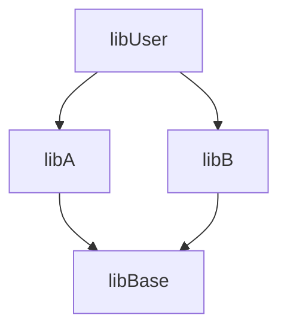

+++
title = "Software Engineer At Google"
description = "A collection of software best practices at Google"
+++


## 1 What is Software Engineering

### 1.1 Time and Change
- Software engineering is programming integrated over time.
    - new features requests, depedency changes, people changes
- Engineers need to be more concerned with the passage of time and the eventual need for change
- Hyrum's Law
```
	With a sufficient number of users of an API, it does not matter what you promise in the contract: all observable behaviors of your system will be depended on by somebody.
```


### 1.2 Scale and Efficiency
- we need to be more concerned about scale and efficiency, both for the software we produce as well as for the organization that is producing it
- Everything your organization relies upon to produce and maintain code should be scalable in terms of overall cost and resource consumption
    - scalable in terms of human effort
- Policies that do not scale well
    - development branches that requires merge to the main branch
        - but what's the solution?
- Policies that scale well
    - ==knowledge sharing== We’ve found that expertise and shared communication forums offer great value as an organization scales.
    - Beyonce rule: if you like it, you should put a CI test on it.


### 1.3 Tradeoffs and Costs
- we are asked to make more ==complex decisions== with higher-stakes outcomes, often based on ==imprecise estimates== of ==time== and ==growth==.
- Different types of costs
    - Financial costs (e.g., money)
    - Resource costs (e.g., CPU time)
    - Personnel costs (e.g., engineering effort)
    - Transaction costs (e.g., what does it cost to take action?)
    - Opportunity costs (e.g., what does it cost to not take action?)
    - Societal costs (e.g., what impact will this choice have on society at large?)
- Shift left:
    - find errors earlier decreases the cost
        - concept - design - development - testing - commit - integration - production
- 2 common decision scenaiors
    1. All of the quantities involved are measurable or can at least be estimated. This usually means that we’re evaluating trade-offs between CPU and network, or dollars and RAM, or considering whether to spend two weeks of engineer-time in order to save N CPUs across our datacenters.
    2. Some of the quantities are subtle, or we don’t know how to measure them. Sometimes this manifests as “We don’t know how much engineer-time this will take.” Sometimes it is even more nebulous: how do you measure the engineering cost of a poorly designed API? Or the societal impact of a product choice?

### 1.4 TL;DR
“Software engineering” differs from “programming” in dimensionality: programming is about producing code. Software engineering extends that to include the maintenance of that code for its useful life span.

There is a factor of at least 100,000 times between the life spans of short-lived code and long-lived code. It is silly to assume that the same best practices apply universally on both ends of that spectrum.

Software is sustainable when, for the expected life span of the code, we are capable of responding to changes in dependencies, technology, or product requirements. We may choose to not change things, but we need to be capable.

Hyrum’s Law: with a sufficient number of users of an API, it does not matter what you promise in the contract: all observable behaviors of your system will be depended on by somebody.

Every task your organization has to do repeatedly should be scalable (linear or better) in terms of human input. Policies are a wonderful tool for making process scalable.

Process inefficiencies and other software-development tasks tend to scale up slowly. Be careful about boiled-frog problems.

Expertise pays off particularly well when combined with economies of scale.

“Because I said so” is a terrible reason to do things.

Being data driven is a good start, but in reality, most decisions are based on a mix of data, assumption, precedent, and argument. It’s best when objective data makes up the majority of those inputs, but it can rarely be all of them.

Being data driven over time implies the need to change directions when the data changes (or when assumptions are dispelled). Mistakes or revised plans are inevitable.


# I CULTURE
## 2. Working Well On Temas

### 2.1 Help Me Hide My Code
- Some people are insecure in showing code that is in progress
    - because no one likes to be criticized
    - because of the genius myth

### 2.2 The Genius Myth
- Genius deconstructed
    - Linus:  Linus did was write just the beginnings of a proof-of-concept Unix-like kernel and show it to an email list. That was no small accomplishment, and it was definitely an impressive achievement, but it was just the tip of the iceberg. Linux is hundreds of times bigger than that initial kernel and was developed by _thousands_ of smart people. Linus’ real achievement was to lead these people and coordinate their work; Linux is the shining result not of his original idea, but of the collective labor  of the communit
    - Michael Jordan: had Phil Jackson and strong set of teammates

### 2.3 Hiding Considered Harmful
- If you spend all of your time working alone, you’re increasing the risk of unnecessary failure and cheating your potential for growth
- If you keep your great idea hidden from the world and refuse to show anyone anything until the implementation is polished, you’re taking a huge gamble.
    - Early sharing isn’t just about preventing personal missteps and getting your ideas vetted.
- So, what “hiding” boils down to is this: working alone is inherently riskier than working with others. Even though you might be afraid of someone stealing your idea or thinking you’re not intelligent, you should be much more concerned about wasting huge swaths of your time toiling away on the wrong thing.


### 2.4 It's All About the Team
- Software engineering is a team endeavor

#### 3 Pillars of Social Interaction
- ==Humility==
    - You are not the center of the universe (nor is your code!). You’re neither omniscient nor infallible. You’re open to self-improvement.
- ==Respect==
    - You genuinely care about others you work with. You treat them kindly and appreciate their abilities and accomplishments.
- ==Trust==
    - You believe others are competent and will do the right thing, and you’re OK with letting them drive when appropriate


#### The 3 Pillars in Practice
- Lose the ego
    - Nobody wants to work with someone who consistently behaves like they’re the most important person in the room. Even if you know you’re the wisest person in the discussion, don’t wave it in people’s face
    - Doesn’t mean you need to be a doormat; there’s nothing wrong with self-confidence. Just don’t come off like a know-it-all. Even better, think about going for a “collective” ego, instead; rather than worrying about whether you’re personally awesome, try to build a sense of team accomplishment and group pride
- Learn to give AND take criticism
    - Giving criticism
        - Be aware if people may be insecure
        - Strive to make the feedback constructive
            - factual and not personal
            - over-arching statements
        - Practice curiousity and understanding tone

    - Taking criticism
        - You are not the code you write
        - Be humble about your skills and trust that the other person has your best interests at heart

### Blameless Post Mortem

#### Being Googley
- Thrives in ambiguity
    - Can deal with conflicting messages or directions, build consensus, and make progress against a problem, even when the environment is constantly shifting.
- Values feedback
    - Has humility to both receive and give feedback gracefully and understands how valuable feedback is for personal (and team) development.
- Challenges status quo
    - Is able to set ambitious goals and pursue them even when there might be resistance or inertia from others.
- Puts the user first
    - Has empathy and respect for users of Google’s products and pursues actions that are in their best interests.
- Cares about the team
    - Has empathy and respect for coworkers and actively works to help them without being asked, improving team cohesion.
- Does the right thing
    - Has a strong sense of ethics about everything they do; willing to make difficult or inconvenient decisions to protect the integrity of the team and product.


## 3 Knowledge Sharing
### 3.1 Challenges to Learning
- Lack of psychological safety
    - An environment in which people are afraid to take risks or make mistakes in front of others because they fear being punished for it. This often manifests as a culture of fear or a tendency to avoid transparency.

- Information islands
    - Knowledge fragmentation that occurs in different parts of an organization that don’t communicate with one another or use shared resources. In such an environment, each group develops its own way of doing things.1 This often leads to the following:

- Information fragmentation
    - Each island has an incomplete picture of the bigger whole.

- Information duplication
    - Each island has reinvented its own way of doing something.

- Information skew
    - Each island has its own ways of doing the same thing, and these might or might not conflict.

- Single point of failure (SPOF)
    - A bottleneck that occurs when critical information is available from only a single person. This is related to bus factor, which is discussed in more detail in Chapter 2.
    - SPOFs can arise out of good intentions: it can be easy to fall into a habit of “Let me take care of that for you.” But this approach optimizes for short-term efficiency (“It’s faster for me to do it”) at the cost of poor long-term scalability (the team never learns how to do whatever it is that needs to be done). This mindset also tends to lead to all-or-nothing expertise.

- All-or-nothing expertise
    - A group of people that is split between people who know “everything” and novices, with little middle ground. This problem often reinforces itself if experts always do everything themselves and don’t take the time to develop new experts through mentoring or documentation. In this scenario, knowledge and responsibilities continue to accumulate on those who already have expertise, and new team members or novices are left to fend for themselves and ramp up more slowly.

- Parroting
    - Mimicry without understanding. This is typically characterized by mindlessly copying patterns or code without understanding their purpose, often under the assumption that said code is needed for unknown reasons.

- Haunted graveyards
    - Places, often in code, that people avoid touching or changing because they are afraid that something might go wrong. Unlike the aforementioned parroting, haunted graveyards are characterized by people avoiding action because of fear and superstition.

### 3.2 Setting the Stage: Psychological Safety
- Software engineering can be defined as the multiperson development of multiversion programs
    - code is an important output but only a small part of building a product
    - code does not emerge spontaneously out of nothing, and neither does expertise. an organization’s success depends on growing and investing in its people.
- Personalized 1-1 advice doers not scale
- Documented knowledge scales better, like team wiki but has tradeoffs
    - it might be more generalized and less applicable to individual learners’ situations, and it comes with the added maintenance cost required to keep information relevant and up to date over time
- You need both documentation and personal 1-1 knowledge
    - Tribal and written knowledge complement each other. Even a perfectly expert team with perfect documentation needs to communicate with one another, coordinate with other teams, and adapt their strategies over time. No single knowledge-sharing approach is the correct solution for all types of learning, and the particulars of a good mix will likely vary based on your organization


### 3.3 Growing Your Knowledge
- Ask Questions
    - The more you know, [the more you know you don’t know](https://oreil.ly/VWusg). Openly asking questions[4](https://learning.oreilly.com/library/view/software-engineering-at/9781492082781/ch03.html#ch01fn29) or expressing gaps in knowledge reinforces that it’s OK for others to do the same

- Understand the Context
    - Learning is not just about understanding new things; it also includes developing an understanding of the decisions behind the design and implementation of existing things
    - [Chesterton's fence wiki](https://en.wikipedia.org/wiki/Wikipedia:Chesterton's_fence)
        -  the principle that reforms should not be made until the reasoning behind the existing state of affairs is understood.
    - Google style guide includes rationale for each style guide


### 3.4 Scaling Your Questions: Ask the Community


### 3.5 Scaling Your Knowledge: You Always Have Something To Teach
- Tech Talks and Classes
- Documentation: update, create, promote documentation

### 3.6 Scaling Your Organization's Knowledge
- Cultivate a Knowledge Sharing Culture
    - Respect
    - Incentives and Recognition
        - encourages engineers to share knowledge by noting these expectations explicitly. part of promotion
        - Ex of senior leadership
            - Growing future leaders by serving as mentors to junior staff, helping them develop both technically and in their Google role
            - Sustaining and developing the software community at Google via code and design reviews, engineering education and development, and expert guidance to others in the field

- Establish Canonical Source of Information
    - Developer Guides
        - Google has a broad and deep set of official guidance for engineers, including [style guides](https://google.github.io/styleguide/), official software engineering best practices,guides for code review (Chapter 9), and testing (Chap 11, 12, 14) and Tips of the Week
    - ==CodeLabs==
        - [some of google's codelab](https://codelabs.developers.google.com/?category=aiandmachinelearning)
        - [github](https://github.com/googlecodelabs/tools)
    - Static Analysis (Chap 20 of book)
        - Powerful way to share best practices that can be checked programatically
        - God way to scale team efficiently
- Staying in the Loop
    - Type of info
        - Knowing how to do a typical development workflow (impt)
        - Update on popular producitivty tools (less impt)
    - Newsletters
    - Communities


### 3.7 Readability: Standardized Mentorship Through  Code Reviews
- Change list requires readbility approvals
  - 
- 1-2% of google engineers are readability reviewer
    - Readability reviewers are held to the highest standards because they are expected not just to have deep language expertise, but also an aptitude for teaching through code review.

- Benefits
    - good to cross pollinate
    - standard code across islands
- Cost but still worth it in my opinion
    - These benefits come with some costs: readability is a heavyweight process compared to other mediums like documentation and classes because it is mandatory and enforced by Google tooling
    - Increased friction for teams that do not have any team members with readability, because they need to find reviewers from outside their team to give readability approval on CLs.
    - Potential for additional rounds of code review for authors who need readability review.
    - Scaling disadvantages of being a human-driven process. Limited to scaling linearly to organization growth because it depends on human reviewers doing specialized code reviews.

## 4 Engineering for Equity


## 5 How To Lead a Team
### 5.1 Managers, TL, and Tech Lead Manager
- Engineering manager is responsible for the performance, productivity, and happiness of every person on their team
    - The needs of the business and the needs of individual team members don’t always align, this can often place a manager in a difficult position.

- Tech Lead is responsible for technology decisions and choices, architecture, priorities, velocity, and general project management

- TLM a single person who can handle both the people and technical needs of their team
    - The job of TLM is a tricky one and often requires the TLM to learn how to balance individual work, delegation, and people management


### 5.2 Moving from IC to Leadership Role
- Many ICs ==don't== want to be a manager
    - not much to point what they have accomplished at the end of day. Quantifying managment work is touch.
    - people rise to the level of their incompetence; so an IC has likely a "crappy" manager
- A good reason for IC to become a manager is because they want to scale themselves
- Servant leadership
    - servant leadership,” which is a nice way of saying the most important thing you can do as a leader is to serve your team, much like a butler or majordomo tends to the health and well-being of a household.
    - removing bureaucratic obstacles that a team member can’t remove by themselves, helping a team achieve consensus, or even buying dinner for the team
    - But how is this good for me ? Isn't this one of the reason why I didn't want to be a TLM at Ebay?

### 5.3 The Engineering Manager
- Dating back to the factories, manager has used the carrot and stick
    - This may not work well; if managers act like parents and treat the employees as chidlren, employees will act like children.
    - Is it better to trust the employees, and the employee fees positive pressure to live up to that trust?
    - _Traditional managers worry about HOW to get things done, whereas great managers worry about WHAT things get done (and trust their team to figure out how to do it)._


### 5.4 Anti-patterns
1. HIre pushovers
    1.  Strive to hire people who are smarter than you and can replace you. This can be difficult because these very same people will challenge you on a regular basis (in addition to letting you know when you make a mistake). These very same people will also consistently impress you and make great things happen. They’ll be able to direct themselves to a much greater extent, and some will be eager to lead the team, as well.
2. Ignore Lower Performers
    1. "Hope is not a strategy"
    2. Coach the low performer
        1. Make the goals small, incremental, and measurable so that there’s an opportunity for lots of small successes
3. Ignore Human Issues
    1. Show empathy to collegues who are going through their various challenges.
4. Be Everyone's Friend
    1. Don’t confuse friendship with leading with a soft touch: when you hold power over someone’s career, they might feel pressure to artificially reciprocate gestures of friendship.
    2. Remember that you can lead a team and build consensus without being a close friend of your team or a hard ass.
5. Compromise the Hiring Bar
6. Treat Your Children Like Children
    1. if you treat them like children or prisoners, don’t be surprised when that’s how they behave

### 5.5 Positive Patterns
1. Lose the Ego
2. Be a Zen Master
    1. This is not to say that you should be naively optimistic at every turn, but you would do well to be less vocally skeptical while still letting your team know you’re aware of the intricacies and obstacles involved in your work
    2. Cogs: Be aware that a little movement at the higher cog( vp) makes the lower cogs move alot.
    3. Your visible attitude about absolutely everything—no matter how trivial—is unconsciously noticed and spreads infectiously to your team
    4. The key is to ==ask questions with humility, respect, and trust==.
3. Be a Catalyst
4. Remove Roadblocks
5. Be a Teacher and Mentor
6. Set Cear Goals
7. Be Honest
    1. _I won’t lie to you, but I will tell you when I can’t tell you something or if I just don’t know._
8. Track Happiness


### 5.6 The Unexpected Questions

### 5.7 Other Tips and Tricks
1. Delegate, but get your hands dirty
2. Seek to replace yourself
    1. ?? Under all circumstance ??
3. Know when to make waves; ie to get your team what they need
4. Shield your team from chaos
5. Let the team know when they're doing well
6. Give your team air cover
    1. Ze'ev was really good at this
    2. it’s just as important that you defend them from a lot of the uncertainty and frivolous demands that can be imposed upon you from outside your team. Share as much information as you can with your team, but don’t distract them with organizational craziness that is extremely unlikely to ever actually affect them
7. It’s easy to say “yes” to something that’s easy to undo


### 5.8 People are Like Plants
- Different people need different things
    - you need to motivate the ones who are in a rut and provide stronger direction to those who are distracted or uncertain of what to do. Of course, there are those who are “adrift” and need both motivation and direction. So, with this combination of motivation and direction, you can make your team happy and productive. And you don’t want to give them too much of either—because if they don’t need motivation or direction and you try giving it to them, you’re just going to annoy them.

- Intrinsic vs Extrinsic Motivation
    - With autonomous employees you might give them the general direction in which they need to take the product but leave it up to them to decide how to get there
    - Give ample opportunities for engineers to learn new things and master their craft so as to keep them sharp, efficient, and effective


### 5.9 Conclusion


## 6 Leading At Scale

### 6.1 Always Be Deciding
- Identify the Blinders
    - Being new to a domain can be an advantage. You can question the old assumptions, ask questions, and then consider new strategies.
- Identify the Key Trade Offs
    - Ex: Latency, Capacity, Quality
- Decide and Iterate


### 6.2 Always Be Leaving
- Your Mission is to Build a Self Driving Team
- Dividing Up the Problem Space
    - Challenging problems are usually composed of difficult subproblems. If you’re leading a team of teams, an obvious choice is to put a team in charge of each subproblem.
        - Caveat: subproblems changes over time, so we need a team structure that can evolve.  Maybe that's why a matrix org

### 6.3 Always Be Scaling
- The Cycles of Success
    - Stages
        1. Analysis
        2. Struggle
        3. Traction
        4. Reward
            1. The reward may be a whole new problem to solve.  (Remember the heart of the machine book?)
      ```mermaid
      graph LR;
          StruggleIth --> FakeIt;
          FakeIt --> Traction;
          Traction --> Reward;
          Reward --> Compression;
          Compression --> StruggleIth;
      ```

    - Compression
        - Definition: solve the old partially-solved problem and new problem
        - The act of compressing a problem isn’t just about figuring out how to maximize your team’s efficiency, but also about learning to scale your own time and attention to match the new breadth of responsibility.


- Important Vs Urgent
- Learn to Drop Balls
    -  If dropping some number of balls is inevitable, isn’t it better to drop certain balls ==deliberately== rather than accidentally?
    - Like Mary Kondo, Divide your pile of balls into three groups: the bottom 20% are probably neither urgent nor important and very easy to delete or ignore. There’s a middle 60%, which might contain some bits of urgency or importance, but it’s a mixed bag. At the top, there’s 20% of things that are absolutely, critically important. ==Tackle the top 20% of the tasks==
- Protecting Your Energy

### 6.4 Conclusion

## 7 Measuring Engineering
### 7.1 What's Goal?
- A goal should be written in terms of a desired property
- 5 Aspects of Productivity (and its trade offs): QuAnts
    - ==Qu==ality of Code
        - What is the quality of the code produced? Are the test cases good enough to prevent regressions? How good is an architecture at mitigating risk and changes?
    - ==A==ttention of Engineer
        - How frequently do engineers reach a state of flow? How much are they distracted by notifications? Does a tool encourage engineers to context switch?
    - I==n==tellecutal complexity
        - How much cognitive load is required to complete a task? What is the inherent complexity of the problem being solved? Do engineers need to deal with unnecessary complexity?
    - ==T==empo and Velocity
        - How quickly can engineers accomplish their tasks? How fast can they push their releases out? How many tasks do they complete in a given timeframe?
    - ==S==atisfaction
        - How happy are engineers with their tools? How well does a tool meet engineers’ needs? How satisfied are they with their work and their end product? Are engineers feeling burned out?


### 7.2 Signals
- A signal is the way in which we will know we’ve achieved our goal
- If the goal is to write high quality code as result of readability process, 2 possible signals are
    1. Engineers who have been granted readability judge their code to be of higher quality than engineers who have not been granted readability.
    2. The readability process has a positive impact on code quality.


### 7.3 Metrics
- Metrics are where we finally determine how we will measure the signal. Metrics are not the signal themselves
    - Ex: a survey


# II PROCESSES

## 8 Style Guides and Rules

## 9 Code Review

- Perspectives
    - Code is a maintenance task to someone somewhere down the line
        - Make sure you have done research on previous library utlility classes
        - Communicate a new design to the proper group before any code is written
    - Code review should be separated from design review
        - design discussion should be done in design document

        - _As much as a code review of entirely new code should not come out of the blue, the code review process itself should also not be viewed as an opportunity to revisit previous decisions._

- Code Review Benefits
    - Code correctness
    - Code comprehension
    - Code consistency
    - Psychologic and cultural benefits
        - _Code review, when it works best, provides not only a challenge to an engineer’s assumptions, but also does so in a prescribed, neutral manner, acting to temper any criticism which might otherwise be directed to the author if provided in an unsolicited manner._
        - _Validation: Even the most capable engineers can suffer from imposter syndrome and be too self-critical. A process like code review acts as validation and recognition for one’s work._
    - Knowledge sharing

- 3 Types of Approvals at Google
    1. Correctness and comprehnesion check that the cod eis appropriate and does what the author claims it does
    2. Code is appropriate for this part of the code base
    3. Readability

- Code Review Best Practices
    1. Be polite and profefssional
        1. Changes can be submitted after those changes are made, without any additional rounds of review
        2. Reviewers should defer to authors on particular approaches and only point out alternatives if the author’s approach is ==deficient==.
            1. If an author can demonstrate that several approaches are equally valid, the reviewer should accept the preference of the author
        3. Reviewers should be careful about jumping to conclusions based on a code author’s particular approach. It’s better to ask questions on why something was done the way it was before assuming that approach is wrong.
        4. Reviewers should avoid responding to the code review in piecemeal fashion.
            1. Few things annoy an author more than getting feedback from a review, addressing it, and then continuing to get unrelated further feedback in the review process.
        5. Commiter treat each reviewer comment within a code review as a TODO item; a particular comment might not need to be accepted without question, but it should at least be addressed.
            1. If you disagree with a reviewer’s comment, let them know, and let them know why and don’t mark a comment as resolved until each side has had a chance to offer alternatives. One common way to keep such debates civil if an author doesn’t agree with a reviewer is to offer an alternative and ask the reviewer to PTAL (please take another look).
            2. Remember that code review is a learning opportunity for both the reviewer and the author. That insight often helps to mitigate any chances for disagreement.
    2. Write Small Changes
    3. Write Good Change Descriptions
        1. _A change description should indicate its type of change on the first line, as a summary. The first line is prime real estate and is used to provide summaries within the code review tool itself_
    4. Keep Reviewers # to a Minimum

- Types of Code Reviews
    - Greenfield project
        - not very common
            - code is a liability; ensure it's really ncessary and solves a real problem rather provide just another alternative
            - requires extensive design review
                - API matches agreed design
        - Imperative to ensure code will stand test of time
            1. Test fully
                1. with unit test
            2. code has proper owners
            3. Sufficiently commented and supplemental documentation
            4. Possible CICD integration

    - Bug Fixes and Rollbacks
        - A bug fix should focus solely on fixing the indicated bug and (usually) updating associated tests to catch the error that occurred in the first place.

    - Refactoring and Large Scale Changes

- Conclusion
    - Code review has many benefits, including ensuring code correctness, comprehension, and consistency across a codebase.
    - Always check your assumptions through someone else; optimize for the reader.
    - Provide the opportunity for critical feedback while remaining professional.
    - Code review is important for knowledge sharing throughout an organization.
    - Automation is critical for scaling the process.
    - The code review itself provides a historical record.

- Google uses [Gerrit code review](https://www.gerritcodereview.com/)


## 10 Documentation
- Answers questions such as
    - Why were these design decisions made?
    - Why did we implement this code in this manner?
    - Why did I implement this code in this manner, if you’re looking at your own code two years later?
- Why are there more documentations?
    - the benefits aren’t immediate, especially to the writer
    - Engineers often view writing as a separate skill than that of programming. (We’ll try to illustrate that this isn’t quite the case, and even where it is, it isn’t necessarily a separate skill from that of software engineering.)
    - Some engineers don’t feel like they are capable writers. But you don’t need a robust command of English2 to produce workable documentation. You just need to step outside yourself a bit and see things from the audience’s perspective.
    - Writing documentation is often more difficult because of limited tools support or integration into the developer workflow.
    - Documentation is viewed as an extra burden—something else to maintain—rather than something that will make maintenance of their existing code easier
- There are different types of documentations; each with its customer
    - Reference documentation, including code comments
    - Design documents
    - Tutorials
    - Conceptual documentation
    - Landing pages


## 11 Testing Overview
- Conclusion
    1. Automated testing is foundational to enabling software to change.
    2. For tests to scale, they must be automated.
    3. A balanced test suite is necessary for maintaining healthy test coverage.
    4. “If you liked it, you should have put a test on it.”
    5. Changing the testing culture in organizations takes time.


## 12 Unit Testing
### 12.1 Importance of Maintainability

- While tests can help code maintenance and quality, ==ineffective== tests can drain productivity and developer satisfaction.

### 12.2 Preventing Brittle Tests
- Brittle tests
    - false negative: fails in the face of unrelated changes; where there is no real bugs.

- Strive for Unchanging Tests
    - We should strive not to change any existing tests after it is written.
        - Types of commits:
            - pure refactoring
            - new features
            - bug fixes
            - behavior changes

- ==Action: Test Via Public APIs==
    - Use the apis that customer will use
      _Given APIs_
``` java
	public void processTransaction(Transaction transaction) {
	  if (isValid(transaction)) {
	    saveToDatabase(transaction);
	  }
	}
	
	private boolean isValid(Transaction t) {
	  return t.getAmount() < t.getSender().getBalance();
	}
	
	private void saveToDatabase(Transaction t) {
	  String s = t.getSender() + "," + t.getRecipient() + "," + t.getAmount();
	  database.put(t.getId(), s);
	}
```


_Naive Ineffective Tests_
``` java
@Test
	public void emptyAccountShouldNotBeValid() {
	  assertThat(processor.isValid(newTransaction().setSender(EMPTY_ACCOUNT)))
	      .isFalse();
	}
	
	@Test
	public void shouldSaveSerializedData() {
	  processor.saveToDatabase(newTransaction()
	      .setId(123)
	      .setSender("me")
	      .setRecipient("you")
	      .setAmount(100));
	  assertThat(database.get(123)).isEqualTo("me,you,100");
	}
```


_Better Tests_
```java
@Test
public void shouldTransferFunds() {
  processor.setAccountBalance("me", 150);
  processor.setAccountBalance("you", 20);

  processor.processTransaction(newTransaction()
      .setSender("me")
      .setRecipient("you")
      .setAmount(100));

  assertThat(processor.getAccountBalance("me")).isEqualTo(50);
  assertThat(processor.getAccountBalance("you")).isEqualTo(120);
}
```


- ==Action: Test State, Not Interactions==
    - In general, there are two ways to verify that a system under test behaves as expected.
        - With state testing, you observe the system itself to see what it looks like after invoking with it.
        - With interaction testing, you instead check that the system took an expected _sequence of actions_ on its collaborators in response to invoking it.
    - _Ineffective_
        - The test verifies that a specific call was made against a database API, but there are a couple different ways it could go wrong:
            - If a bug in the system under test causes the record to be deleted from the database shortly after it was written, the test will pass even though we would have wanted it to fail.
            - If the system under test is refactored to call a slightly different API to write an equivalent record, the test will fail even though we would have wanted it to pass.

```java
		@Test
		public void shouldWriteToDatabase() {
		  accounts.createUser("foobar");
		  verify(database).put("foobar");
		}
```

* _Effective_
    * Here, we are testing the state of the system under test after interacting with it.
  ```java
          @Test
      public void shouldCreateUsers() {
        accounts.createUser("foobar");
        assertThat(accounts.getUser("foobar")).isNotNull();
      }
  ```


### 12.3 Writing Clear Tests
- Make Your Test Complete and Concise
    - A test is complete when its body contains all of the information a reader needs in order to understand how it arrives at its result.
    - A test is concise when it contains no other distracting or irrelevant information
    - _Ineffective_
       ``` java
  @Test
  public void shouldPerformAddition() {
  Calculator calculator = new Calculator(new RoundingStrategy(),
  "unused", ENABLE_COSINE_FEATURE, 0.01, calculusEngine, false);
  int result = calculator.calculate(newTestCalculation());
  assertThat(result).isEqualTo(5);//Where did this number come from?
  }
  ```

    - _Effective_
  ```java
  @Test
  public void shouldPerformAddition() {
    Calculator calculator = newCalculator();
    int result = calculator.calculate(newCalculation(2, Operation.PLUS, 3));
    assertThat(result).isEqualTo(5);
  }
  ```


- Test  Behaviors; Not Methods
    - Rationale
        - Ineffective: every production method has ==one== test.  As the method under test becomes more complex and implements more functionality, its unit test will become increasingly convoluted and grow more and more difficult to work with
        - Better: each production has N tests, one for each of the method's behavior we want to verify.
    - Example
        - _Method To Test_
      ```java
  public void displayTransactionResults(User user, Transaction transaction) {
  ui.showMessage("You bought a " + transaction.getItemName());
  if (user.getBalance() < LOW_BALANCE_THRESHOLD) {
  ui.showMessage("Warning: your balance is low!");
  }
  }
  ```
  - _Ineffecive_
  ```java
  @Test
  public void testDisplayTransactionResults() {
  transactionProcessor.displayTransactionResults(
  newUserWithBalance(
  LOW_BALANCE_THRESHOLD.plus(dollars(2))),
  new Transaction("Some Item", dollars(3)));
  // Ineffective because these makes this test non-concise; each new behavior requires us to update this method. We strive for unchanged tests.
  assertThat(ui.getText()).contains("You bought a Some Item");
  assertThat(ui.getText()).contains("your balance is low");
  }
  ```
  - _Effective_
  ```java
  @Test
  public void displayTransactionResults_showsItemName() {
  transactionProcessor.displayTransactionResults(
  new User(), new Transaction("Some Item"));
  assertThat(ui.getText()).contains("You bought a Some Item");
  }

  	@Test
  	public void displayTransactionResults_showsLowBalanceWarning() {
  	  transactionProcessor.displayTransactionResults(
  	      newUserWithBalance(
  	          LOW_BALANCE_THRESHOLD.plus(dollars(2))),
  	      new Transaction("Some Item", dollars(3)));
  	  assertThat(ui.getText()).contains("your balance is low");
  	}
  	```
    - Writing tests as behaviours influences our test strcuture
        - Every behavior has three parts:
            - a “given” component that defines how the system is set up,
            - a “when” component that defines the action to be taken on the system, and
            - a “then” component that validates the result.6 Tests are clearest when this structure is explicit.
        - Doesn't one of the testing framework follow this flow?
        - Example
      ```java
      @Test
      public void transferFundsShouldMoveMoneyBetweenAccounts() {
        // Given two accounts with initial balances of $150 and $20
        Account account1 = newAccountWithBalance(usd(150));
        Account account2 = newAccountWithBalance(usd(20));
      
        // When transferring $100 from the first to the second account
        bank.transferFunds(account1, account2, usd(100));
      
        // Then the new account balances should reflect the transfer
        assertThat(account1.getBalance()).isEqualTo(usd(50));
        assertThat(account2.getBalance()).isEqualTo(usd(120));
      }
      ```


- Don't Put Logic In Tests

- Write Clear Failure Messages
    - _Ineffective_
        - "Test failed: account is closed"
    - _Effective_
        - Expected an account in state CLOSED, but got account:
          <{name: "my-account", state: "OPEN"}


### 12.4 Test and Code Sharing: DAMP, not DRY
- Rationale
    - In production code, we strive to be DRY: Don't Repeat Yourself. So we have common libraries.
        - The downside to such consolidation is that it can make code unclear, requiring readers to follow chains of references to understand what the code is doing. (MC-Kernel)
    - Test code should often strive to be DAMP—that is, to promote “Descriptive And Meaningful Phrases.” A little bit of duplication is OK in tests so long as that duplication makes the test simpler and clearer
        - _Ineffective_
      ```java
      @Test
      public void shouldAllowMultipleUsers() {
        List<User> users = createUsers(false, false);
        Forum forum = createForumAndRegisterUsers(users);
        validateForumAndUsers(forum, users);
      }
      
      @Test
      public void shouldNotAllowBannedUsers() {
        List<User> users = createUsers(true);
        Forum forum = createForumAndRegisterUsers(users);
        validateForumAndUsers(forum, users);
      }
      
      // Lots more tests...
      
      private static List<User> createUsers(boolean... banned) {
        List<User> users = new ArrayList<>();
        for (boolean isBanned : banned) {
          users.add(newUser()
              .setState(isBanned ? State.BANNED : State.NORMAL)
              .build());
        }
        return users;
      }
      ```

        - _Effective_
      ```java
      @Test
        public void shouldAllowMultipleUsers() {
          User user1 = newUser().setState(State.NORMAL).build();
          User user2 = newUser().setState(State.NORMAL).build();
        
          Forum forum = new Forum();
          forum.register(user1);
          forum.register(user2);
        
          assertThat(forum.hasRegisteredUser(user1)).isTrue();
          assertThat(forum.hasRegisteredUser(user2)).isTrue();
  }

  ```

- Example: Shared Values
    - Many tests are structured by defining a set of shared values to be used by tests and then by defining the tests that cover various cases for how these values interact.
    - _Example: Ineffective_
      ```java
      private static final Account ACCOUNT_2 = Account.newBuilder()
          .setState(AccountState.CLOSED).setBalance(0).build();
      
      private static final Item ITEM = Item.newBuilder()
          .setName("Cheeseburger").setPrice(100).build();
      
      // Hundreds of lines of other tests...
      
      @Test
      public void canBuyItem_returnsFalseForClosedAccounts() {
        assertThat(store.canBuyItem(ITEM, ACCOUNT_1)).isFalse();
      }

      ```
    - This strategy can make tests very concise, but it causes problems as the test suite grows. For one, it can be difficult to understand why a particular value was chosen for a test
    - A better way to accomplish this goal is to construct data using helper methods (see Example 12-22) that require the test author to specify only values they care about, and setting reasonable defaults
    - _Example-Better_
      ```java
      # A helper method wraps a constructor by defining arbitrary defaults for
      # each of its parameters.
      def newContact(
          firstName="Grace", lastName="Hopper", phoneNumber="555-123-4567"):
        return Contact(firstName, lastName, phoneNumber)
      
      # Tests call the helper, specifying values for only the parameters that 
      they # care about.
      def test_fullNameShouldCombineFirstAndLastNames(self):
        def contact = newContact(firstName="Ada", lastName="Lovelace")
        self.assertEqual(contact.fullName(), "Ada Lovelace")
      ```

- Example: Shared Setup
    - Used appropriately, these methods can make tests clearer and more concise by obviating the repetition of tedious and irrelevant initialization logic.
    - One risk in using setup methods is that they can lead to unclear tests if those tests begin to depend on the particular values used in setup
        - _Exampe: Ineffective: Where does Donald Knuth come from?_
      ```java
      @Before
      public void setUp() {
        nameService = new NameService();
        nameService.set("user1", "Donald Knuth");
        userStore = new UserStore(nameService);
      }
      
      // [... hundreds of lines of tests ...]
      
      @Test
      public void shouldReturnNameFromService() {
        UserDetails user = userStore.get("user1");
        assertThat(user.getName()).isEqualTo("Donald Knuth");
      }
      ```
    - It is better when a test defines/over-rides all the variable it requires
      _Example: Better_
      ```java
      private NameService nameService;
      private UserStore userStore;
      
      @Before
      public void setUp() {
        nameService = new NameService();
        nameService.set("user1", "Donald Knuth");
        userStore = new UserStore(nameService);
      }
      
      @Test
      public void shouldReturnNameFromService() {
        nameService.set("user1", "Margaret Hamilton");
        UserDetails user = userStore.get("user1");
        assertThat(user.getName()).isEqualTo("Margaret Hamilton");
      }
      ```
- Example: Shared Helpers and Validation
    - Shared helper method should have a specific purpose
        - Ex: Validation helper method asserts a single conceptual fact about their inputs
      ```java
      private void assertUserHasAccessToAccount(User user, Account account) {
        for (long userId : account.getUsersWithAccess()) {
          if (user.getId() == userId) {
            return;
          }
        }
        fail(user.getName() + " cannot access " + account.getName());
      }
      ```


### 12.5 Conclusion
- Strive for unchanging tests.
- Test via public APIs.
- Test state, not interactions.
- Make your tests complete and concise.
- Test behaviors, not methods.
- Structure tests to emphasize behaviors.
- Name tests after the behavior being tested.
- Don’t put logic in tests.


## 13 Testing Doubles


## 14 Larger Testing


## 15 Deprecation


# III TOOLS

## 16 Version Control and Branch Management


## 17 Code Search


## 18 Build System and Build Philosophy
### 18.1 Purpose of Build Systems

### 18.2 What happens if no build System
- why not ust use a compiler (like javac or gcc)?
    - When we need to scale
        - across our project directories
        - mulitiple compilation units
        - across programming lagnagues
- Why not just a shell script?
    - Does not scale with complexity: lacks abstraction
    - hard to debug
    - It's slow build

### 18.3 Moden Build Systems
- Modern build systems is all about managing the dependencies
    - tasks (documentation befor e release; external dependencies)
- Tasks Based Build Systems (Mvn, Ant)
    -  the fundamental unit of work is the task. Each task is a script of some sort that can execute any sort of logic, and tasks specify other tasks as dependencies that must run before them.
    - Cons
        - hard to parallelize build steps
        - difficulat to perform incremental build
        - difficult to maintain and debug scripts

- Artifact Based Build Systems (Bazel)
    - Declare the artifacts you are building; it's ==declarative== like k8s
        - users specify a set of targets to build (the “what”), and Blaze is responsible for configuring, running, and scheduling the compilation steps (the “how”)
  ```
  java_binary(
    name = "MyBinary",
    srcs = ["MyBinary.java"],
    deps = [
      ":mylib",
    ],
  ) 
  
  java_library(
  name = "mylib",
  srcs = ["MyLibrary.java", "MyHelper.java"],
  visibility = ["//java/com/example/myproduct:__subpackages__"],
  deps = [
      "//java/com/example/common",
      "//java/com/example/myproduct/otherlib",
      "@com_google_common_guava_guava//jar",
  ],
  )
  ```

- Distributed Builds
- Time, Scale, and Tradeoffs


## 19: Critique: Google Code Review Tools


## 20 Static Analysis


## 21 Dependency Management
### 21.1 Why Dependency Management Is So Difficult
- Boils down to the Diamond Dependency problem
    - what happens when two nodes in the dependency network have conflicting requirements, and your organization depends on them both


- only easy answer is to skip forward or backward in versions for those dependencies to find something compatible.
    - When that isn’t possible, we must resort to locally patching the dependencies in question, which is particularly challenging because the cause of the incompatibility in both provider and consumer is probably not known to the engineer that first discovers the incompatibility

### 21.2 Importing Dependencies
- Reuse is healthy, especially compared to the cost of redeveloping quality software from scratch. So long as you aren’t downloading trojaned software, if your external dependency satisfies the requirements for your programming task, you should use it

- Compatibility Promises for different langagues
    - C++:  nearly indefinite backward compatibility.
        - Wow. Downside is once something is published, it is hard to undo
    - Go:
        - You ==cannot== build a library in Go with one version of the language and link that library into a Go program built with a different version of the language.


- Considerations When Importing
    - Does the project have tests that you can run?
        - Do those tests pass?
    - Who is providing that dependency? Even among “No warranty implied” OSS projects, there is a significant range of experience and skill set—it’s a very different thing to depend on compatibility from the C++ standard library or Java’s Guava library than it is to select a random project from GitHub or npm. Reputation isn’t everything, but it is worth investigating.
    - What sort of compatibility is the project aspiring to?
    - Does the project detail what sort of usage is expected to be supported?
    - How popular is the project?
    - How long will we be depending on this project?
    - How often does the project make breaking changes?

- How Google Handles Importing Dependencies
    - The overwhelming majority of dependencies in any given Google project are internally developed.

### 21.3 Dependency Management, In Theory
1. Nothing Changes; don't change the dependenceis
2. Semantic Versioning
    1. SemVer is the nearly ubiquitous practice of representing a version number for some dependency
    2. IE: 2.4.71
        1. major.minor.patch
        2. major # change represent signifcant incompatibility
    3. We can specificy library > 1.5
3. Bundled Distribution Model
    1. aka Spark's Uber Jar
4. Live At Head
### 21.4 Limitations of SemVer

### 21.5 Dependency with Infinit Resources

### 21.6 Conclusoin
- Prefer source control problems to dependency management problems: if you can get more code from your organization to have better transparency and coordination, those are important simplifications.

- Adding a dependency isn’t free for a software engineering project, and the complexity in establishing an “ongoing” trust relationship is challenging. Importing dependencies into your organization needs to be done carefully, with an understanding of the ongoing support costs.

- A dependency is a contract: there is a give and take, and both providers and consumers have some rights and responsibilities in that contract. Providers should be clear about what they are trying to promise over time.

- SemVer is a lossy-compression shorthand estimate for “How risky does a human think this change is?” SemVer with a SAT-solver in a package manager takes those estimates and escalates them to function as absolutes. This can result in either overconstraint (dependency hell) or underconstraint (versions that should work together that don’t).

- By comparison, testing and CI provide actual evidence of whether a new set of versions work together.

- Minimum-version update strategies in SemVer/package management are higher fidelity. This still relies on humans being able to assess incremental version risk accurately, but distinctly improves the chance that the link between API provider and consumer has been tested by an expert.

- Unit testing, CI, and (cheap) compute resources have the potential to change our understanding and approach to dependency management. That phase-change requires a fundamental change in how the industry considers the problem of dependency management, and the responsibilities of providers and consumers both.

- Providing a dependency isn’t free: “throw it over the wall and forget” can cost you reputation and become a challenge for compatibility. Supporting it with stability can limit your choices and pessimize internal usage. Supporting without stability can cost goodwill or expose you to risk of important external groups depending on something via Hyrum’s Law and messing up your “no stability” plan.


## 22 Large Scale Changes


## 23 Continuous Integration
- Conclusion
    - A CI system decides what tests to use, and when.

    - CI systems become progressively more necessary as your codebase ages and grows in scale.

    - CI should optimize quicker, more reliable tests on presubmit and slower, less deterministic tests on post-submit.

    - Accessible, actionable feedback allows a CI system to become more efficient.


## 24 Continuous Delivery
- Conclusion
    - Velocity is a team sport: The optimal workflow for a large team that develops code collaboratively requires modularity of architecture and near-continuous integration.

    - Evaluate changes in isolation: Flag guard any features to be able to isolate problems early.

    - Make reality your benchmark: Use a staged rollout to address device diversity and the breadth of the userbase. Release qualification in a synthetic environment that isn’t similar to the production environment can lead to late surprises.

    - Ship only what gets used: Monitor the cost and value of any feature in the wild to know whether it’s still relevant and delivering sufficient user value.

    - Shift left: Enable faster, more data-driven decision making earlier on all changes through CI and continuous deployment.

    - Faster is safer: Ship early and often and in small batches to reduce the risk of each release and to minimize time to market.


## 25 Compute As a Service (CaaS)

### 25.1 Taming the Compute Environment
- In the old days, Jeff Dean needs to do this to run a compute data processing task
```
	[Running the task] is a logistical, time-consuming nightmare. It currently requires getting a list of 50+ machines, starting up a process on each of these 50+ machines, and monitoring its progress on each of the 50+ machines. There is no support for automatically migrating the computation to another machine if one of the machines dies, and monitoring the progress of the jobs is done in an ad hoc manner [...] Furthermore, since processes can interfere with each other, there is a complicated, human-implemented “sign up” file to throttle the use of machines, which results in less-than-optimal scheduling, and increased contention for the scarce machine resources
```

- Approach 1: simple automations (think Chuck at NPD or Apple)
- Approach 2: Containerization and Multi-tenancy
    - addresses the 1 program 1 machine paradigm; better usage
- Improvment: right sizing with replica size and auto-scaling
- As org and product scales, we need to look at these axes:
    - Number of different applications to be managed
    - Number of copies of an application that needs to run
    - The size of the largest application


### 25.2 Writing Software for Managed Compute
* Architecting for Failure
    * K8s service abstraction over k8s pods; pods can fail, but we can restart automatically

* Batch Versus Serving
    - Serving: program that runs indefinitely and serves incoming requests
    - Batch: program that completes a task and runs to completion
        - Batch jobs are primarily interested in throughput of processing. Serving jobs care about latency of serving a single request.
        - Batch jobs are short lived (minutes, or at most hours). Serving jobs are typically long lived (by default only restarted with new releases).
        - Because they’re long lived, serving jobs are more likely to have longer startup times.


* Managing State
    * Easiest: make it stateless and extract all storage to an external storage system
        * But how is external storage system implemented with failover (ie with replicatoin)
    * Another type of state is cache
        * if cache goes down, and service has enough capacity, then we just have a latency hit.

* Connecting to a Service
    * other applications refer to your application by some identifier that is durable across restarts of the specific “backend” instances
        * This is called service discovery (ie Zookeeper)


### 25.3 CaaS Over Time and Scale


### 25.4 Choosing a Compute Service

- Centralization vs Customization

- Level of Abstraction: Serverless
    - What is serverless?
        - The key defining trait of a framework is the inversion of control—so, the user will only be responsible for writing an “Action” or “Handler” of some sort—a function in the chosen language that takes the request parameters and returns the response.
        - ==The executed code has to be stateless==
    - Pro
        - Don't need to provision cluster
        - can scale cost to 0 if traffic is 0
        - adaptable scaling
    - Con
        - Code has to be stateless; request-scope
- Public vs Private
    - Private (ie Ebay)
        - all the managment of the cluster/infra will be on to you.
    - Public Cloud
        - An organization using a public cloud is effectively outsourcing (a part of) the management overhead to a public cloud provider.  Not bad.
        - But how not to be lock in?
            - use open source (ie K8s) to run on EC2.
    - Hybrid cloud: AWS + Google CLoud + private
        - hybrid cloud strategies require the multiple environments to be connected well, through direct network connectivity between machines in different environments and common APIs that are available in both

### 25.5 Conclusion
- Scale requires a common infrastructure for running workloads in production.
- A compute solution can provide a standardized, stable abstraction and environment for software.
- Software needs to be adapted to a distributed, managed compute environment.
- The compute solution for an organization should be chosen thoughtfully to provide appropriate levels of abstraction.
